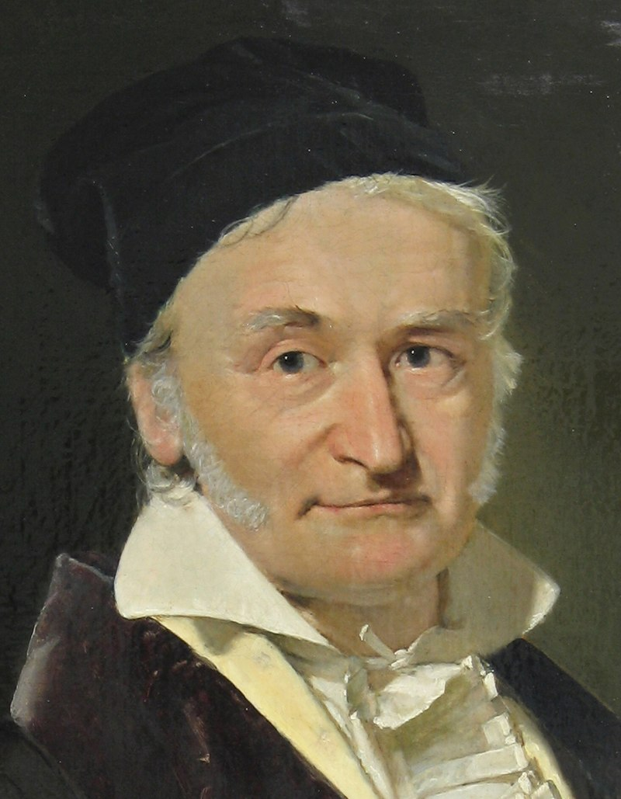

```{r setup, include=FALSE}

#          browseURL('https://raw.githack.com/')
#          browseURL('https://github.com/ajkirkpatrick/EC420MSU')


options(htmltools.dir.version = FALSE)
options("getSymbols.warning4.0"=FALSE)


library(here) # creates absolute paths, but those won't work in html
library(knitr)
library(kableExtra)
library(tidyverse)
library(wooldridge)
require(lubridate)
require(scales)
require(broom)
require(visualize)


# https://yihui.org/knitr/options/
opts_chunk$set(
  fig.align="center",
  #dpi=300, 
  fig.path='figs/', # where figs are rendered
  cache=F,
  echo=F,
  message = F,
  warning = F
  )

oldgraphics = "C:/Users/jkirk/OneDrive - Michigan State University/Teaching/EC420MSU/graphics"
dir.create('img')
  
# A vital function to take an absolute path and copy the image into a local img folder.
# # Solves the issue where the rendered html wasn't pointing to the right things. 
# ## Wrap path into includ_graphics() like so:

    #     include_graphics(copy_to_include(path = "C:/Users/jkirk/OneDrive - Michigan State University/Teaching/EC420online/img/MMfig43a.png"))
copy_to_include<-function(path){
  filename.to.use = basename(path)
  if(!grepl('png$|PNG$|jpg$|JPG$', filename.to.use)) stop('Not a png or jpg')

  file.copy(from = path, to = paste0('img/',filename.to.use))
  return(paste0('img/',filename.to.use))
}

```

layout: true

<div class="msu-header"></div>  


<div style = "position:fixed; visibility: hidden">
$$\require{color}\definecolor{yellow}{rgb}{1, 0.8, 0.16078431372549}$$
$$\require{color}\definecolor{orange}{rgb}{0.96078431372549, 0.525490196078431, 0.203921568627451}$$
$$\require{color}\definecolor{MSUgreen}{rgb}{0.0784313725490196, 0.52156862745098, 0.231372549019608}$$
</div>

<script type="text/x-mathjax-config">
MathJax.Hub.Config({
  TeX: {
    Macros: {
      yellow: ["{\\color{yellow}{#1}}", 1],
      orange: ["{\\color{orange}{#1}}", 1],
      MSUgreen: ["{\\color{MSUgreen}{#1}}", 1]
    },
    loader: {load: ['[tex]/color']},
    tex: {packages: {'[+]': ['color']}}
  }
});
</script>

<style>
.yellow {color: #FFCC29;}
.orange {color: #F58634;}
.MSUGreen {color: #14853B;}
</style>


```{r flair_color, echo=FALSE}
library(flair)
yellow <- "#FFCC29"
orange <- "#F58634"
MSUGreen <- "#14853B"
```


---

class: inverseMSU
name: Overview

# This Deck  

### __Lectures:__
1. [Population Regression Function: What are we after?](#section1)

2. [Ordinary Least Squares](#section2) with an [example](#ExampleOLS)

3. [Goodness of fit measures](#section3)

4. [Interpretation of coefficients](#section4)

5. [Rescaling Y and X](#section5)

6. [Non-linear functional forms](#section6)

7. [Regression in R](#section7)

8. [Inference and hypothesis testing: Expectation of $\hat{\beta}_1$](#section8)

9. [Inference and hypothesis testing: Variance of $\hat{\beta}_1$](#section9)

10. [An example](#section10)

---
class: heading-slide
name: section1

Population Regression Function

### [top](#Overview)


---
class: MSU

# The problem at hand...

We have some data on two (or more, later) variables that we think move together in an interesting way.
- Wage and education
- Cigarette smoking and life expectancy
- COVID cases and vaccine rates

--

We want to quantify and test this relationship
- Predict a change
- Test a theory
- Win a bet?

--

We have a **sample**, but want to predict/test something about the population


---
class: MSU

# The problem at hand...

Wage data used in Wooldridge `wage2`

```{r Wooldridge, echo=F, include=T}
df = wooldridge::wage2
meanwage = mean(df$wage)
meaneduc = mean(df$educ)
covwageeduc = cov(df$educ, df$wage)
d = ggplot(df, aes(x = educ, y = wage)) + geom_point() + theme_bw()
d
```

.footnote[Data from Blackburn and Neumark (1992), "Unobserved Ability, Efficiency Wages, and Interindustry Wage Differentials" *Quarterly Journal of Economics* 107, 1421-1436]


---
class: MSU

# The problem at hand

.pull-left[
The data looks like this:  

```{r Wooldridge2, echo=F, include=T, message = F, warning=F, cache = T, out.width = '60%'}
knitr::kable(head(df %>% dplyr::select(wage, educ)), format = 'latex', align='c') %>%
  as_image(file = 'img/wol2.png', width=4)
  
```
]

.pull-right[
```{r Wooldridge3, echo=F, include=T, warnings=F}
d
```
]

$N = 935$, $\overline{wage} = `r round(meanwage, 2)`$ and $\overline{educ} = `r round(meaneduc, 2)`$

--

What we'd like to have is a function that tells us how $wage$ and $educ$ move together in the **population**

---
class: MSU
# Population Regression Function

### In a perfect world, we would have some function for $X = educ$ and $Y = wage$:

$$g(x) = y$$

Where we give the function any realization of $x$, and it spits out exactly $y$.
--

### But that isn't going to happen
Think about the data we just looked at - when $educ = 12$ we observed $wage=769$ and $wage=650$. The dream function doesn't exist! There are other things not accounted for besides $educ$.

---
class: MSU
# Population Regression Function

### So we settle for something that tells us about the **expectation** of $Y$. The Population Regression Function

$$E[Y|X] = \beta_0 + \beta_1 X$$

The *Population Regression Function* (PRF) describes the relationship between $X$ and the **conditional expectation** of $Y$.
- $X$ and $Y$ are random variables
- $\beta_0$ and $\beta_1$ are **population parameters**
- We have restricted the $E[Y|X]$ to be a *linear* function of $X$.
  - It can be drawn as a straight line with an intercept and constant slope
  - We will be estimating $\beta_0$ and $\beta_1$
  
---
class: MSU
# Population Regression Function

### The PRF:
$$E[Y|X] = \beta_0 + \beta_1 X$$

Let $Y=wage$ and $X=educ$
- $E[Y|X=x]$ gives us the expectation of $Y$ (wage) conditional on some realized value of $X=x$ (educ)

- So, if $educ=16$, then $E[Y|X=16] = \beta_0 + \beta_1 \times 16$
  - We can plug in any $x_i$ and get the **expected value** of the paired $y_i$
  
---
class: MSU
# Population Regression Function

### Question: Will the PRF return exactly $y_i$ given a value $x_i$?

--

.orange[No.] It can only give us the expectation.

---
class: MSU
name: WoolPRF

# Population Regression Function

<br>

```{r Wooldridge21, echo=F, out.width = '50%', fig.cap = 'Ch. 2.1 of Wooldridge, example of a conceptual PRF. The line defines the PRF, the expectation of Y conditional on X'}
knitr::include_graphics(copy_to_include(file.path(oldgraphics,'Wooldridge/Figure 2-1.jpg')))

# .footnote[From Ch. 2.1 of Wooldridge. Shows an example of a conceptual PRF. The line defines the PRF, the expectation of $Y$ conditional on $X$]
```


---
class: MSU
# Population Regression Function

```{r PRF, echo=F, include=T}
df$educf = as.factor(df$educ)
v = ggplot(df, aes(x = as.factor(educ), y = wage)) + geom_violin()  + xlab('educ')
v
```

This is the wage data. Each "blob" is an empirical histogram of the data for that value of $educ$ (they are symmetrical). This is called a *violin plot*. It is the empirical counterpart of the [previous plot from Wooldridge](#WoolPRF)

---

class: MSU

# Population Regression Function

```{r PRF2, echo=F, include=T, warning=F, message=F}
v + geom_point(data=df %>% dplyr::group_by(educf) %>% summarize(mwage = mean(wage, na.rm=T)), aes(x = educf, y=mwage)) 
```

Each point is the sample mean for each value of $educ$.

---
class: MSU
# Population Regression Function

```{r PRF2line, echo=F, include=T, warning=F, message=F}
v + geom_point(data=df %>% dplyr::group_by(educf) %>% summarize(mwage = mean(wage, na.rm=T)), aes(x = educf, y=mwage)) + geom_abline(intercept = 146.9 + 9*60.215, slope = 60.21)
```
A (linear) PRF would be the straight line that best fits the data. **Regression fits that line**. A brief look at the line shows that it certainly won't be perfect!


---
class: MSU
# Fitting the line

### What happens, then, if we want to write $Y$ exactly?
The PRF gives us the *expectation* of $Y$
- So we add a **stochastic error term**, the difference between $E[Y|X]$ and $Y$:

$$Y = E[Y|X] + U = \beta_0 + \beta_1 X + U$$
This is the stochastic population regression function

$U$ is also the **population error term**, and is itself a **random variable**.
- It must be that $E[U] = 0$

---
class: MSU
name: regEqn
# Fitting the line

### Now we can write our **simple linear regression model**:

$$y = \beta_0 + \beta_1 x + u$$

This is a statement about the relationship between observed realizations $(y_i, x_i)$ based on the population parameters $\beta_0, \beta_1$

We will call $u$ the **error term** - it is the difference between the conditional expected mean and the observed $y_i$ given a value of $x_i$.
- It might be different for two identical realizations of $x_i$

--

Naturally, we would think that the "right" value of the population parameters, $\beta = \{\beta_0, \beta_1\}$<sup>*</sup>, minimizes all of the $u_i$ values in a sample. That's where Ordinary Least Squares comes in.


.footnote[<sup>*</sup> A parameter vector is just a list of numbers.]

---
class: MSU
# Fitting the line

### The Sample Regression Function

$$\hat{y}_i = \hat{\beta}_0 + \hat{\beta_1} x_i$$

### The "hats" are important
They mean we have a *sample estimate* of the population parameters.
- $\beta_0, \beta_1$ are the population
- $\hat{\beta}_0, \hat{\beta}_1$ are the sample estimates and will change when the sample changes
  - So they are random variables!

--


### Where did $u$ go?
Since we have a hat on $y_i$, there is no $u$, but $\hat{y}_i \neq y_i$.
- Define $\hat{u}_i = \hat{y}_i - y_i$.
- $\hat{u}_i$ is the *residual*.
  
---
class: MSU
# Fitting the line

### To summarize:

The $PRF$ is
$$E[Y|X] = \beta_0 + \beta_1 X$$

The simple linear regression model is:
$$y = \beta_0 + \beta_1 x + u$$

The SRF is:
$$\hat{y}_i = \hat{\beta}_0 + \hat{\beta}_1 x_i$$

And if we want to write the sample regression model:
$$y_i = \hat{\beta}_0 + \hat{\beta}_1 x_i + \hat{u}_i$$


---
class: heading-slide
name: section2

Ordinary Least Squares

### [top](#Overview)

---
class: MSU
# Fitting the line

### We have a linear PRF
$$E[Y|X] = \beta_0 + \beta_1 X$$

### What happens, then, if we want to write $Y$ exactly?
The PRF gives us the *expectation* of $Y$
- So we add that **stochastic error term**, the difference between $E[Y|X]$ and $Y$:

$$Y = E[Y|X] + U = \beta_0 + \beta_1 X + U$$
This is the stochastic population regression function

$U$ is also the **population error term**, and is itself a **random variable**.
- It must be that $E[U] = 0$


### And we can write our SRF:

$$\hat{y}_i = \hat{\beta}_0 + \hat{\beta}_1 x_i$$


---
class: MSU
# Fitting the line

## How do we get those $\hat{\beta}$'s in the SRF?
<br>
#### We make two assumptions:

**First**, if the expectation of $Y$ equals $\beta_0 + \beta_1 X$, then *in expectation*, $E[U] = 0$. Because:
$$E[Y|X] = \beta_0 + \beta_1 X \quad \text{and} \quad Y = \beta_0 + \beta_1 X + U$$
<br><br>

**Second**, our first assumption should hold no matter what $x$ is. So, it should be true that $E[U|X] = 0$ for **all** possible values of $X$.

There are very important assumptions as they will define our Sample Regression Function (SRF).

---
class: MSU
# Fitting the line

### Let's make these assumptions formal:

1. $E[U]=0$. 
  - As long as there is a $\beta_0$ (regardless of $\beta_1$), this is true. We call this assumption **trivial**.

2. $E[U|X] = E[U]$ 
  - **Mean independence**. The **mean** of $U$ is the same, regardless of the value of $X$:

These are **population moments**
- A **moment** is a specific attribute of a distribution

--

Economists spend a lot of time showing mean independence $E[U|X] = E[U]$.

---
class: MSU

# Fitting the line

Two quick math reminders before we introduce the Ordinary Least Squares (OLS) estimator for $\beta$:
$$Cov(Y,X) = E[YX] - E[Y]E[X]$$
and
$$\text{If} \quad E[U]=0$$
then 
$$Cov(U,X) = E[UX] - E[U]E[X] = E[UX] - 0$$

--

And note that the simple linear regression model $y = \beta_0 + \beta_1 x + u$ implies that:
$$u = y - \beta_0 - \beta_1 x$$


---

class: MSU
# OLS in 1 variable

### Since $u = y - \beta_0 - \beta_1 x$:
Let's write Assumption 1 and Assumption 2 using expectations of the [regression model from before](#regEqn)
- $E[U]=0 \Rightarrow E[(y - \beta_0 - \beta_1 x)] = 0$
- $E[U|X] = 0 \Rightarrow E[x(y - \beta_0 - \beta_1 x)] = 0$
  - To see this, picture any expected value of $x$. Now, multiply it by $0$.


- How many equations?

- How many unknowns?


## Let's solve for $\beta$. To the "board"!

--

These are *moments*, and this way of deriving $\beta$ is known as "method of moments".

---

class: MSU

# OLS in 1 variable

What we just derived on the board depends on **population** moments: $Cov(X,Y)$ and $Var(X)$.

But, just as before when we didn't know $\mu$ but we could calculate $\bar{y}$ (and we even know something about the distribution of $\bar{y}$), .orange[we can calculate sample values for] $Cov(X,Y)$ and $Var(X)$

--

### Sample estimates get a $\hat{\quad}$
So if we take a sample and calculate, from that sample, $Var(X)$, we would call it $\widehat{Var}(X)$


---

class: MSU
# OLS in 1 variable

First, let's tackle the estimate of $\hat{\beta_1}$.

We know how to calculate the sample covariance:
- $\widehat{Cov}(Y,X) = \frac{1}{N-1} \sum_{i=1}^{N} (x_i - \bar{x})(y_i - \bar{y})$

We know how to calculate the sample variance:
- $\widehat{Var}(X) = \frac{1}{N-1} \sum_{i=1}^{N} (x_i - \bar{x})^2$

$$\hat{\beta}_1 = \frac{\widehat{Cov}(Y,X)}{\widehat{Var}(X)} = \frac{\frac{1}{N-1} \sum_{i=1}^{N} (x_i - \bar{x})(y_i - \bar{y})}{\frac{1}{N-1} \sum_{i=1}^{N} (x_i - \bar{x})^2}$$

--

What is important here is that **these are all observable in the data, and you know how to calculate them**. You know how to calculate $\bar{x}$ and $\bar{y}$, you know how to sum things, and you know $x_i$ and $y_i$ in the data.

**As long as your assumptions hold**, you have an estimate of the PRF.


---
class: MSU
# OLS in 1 variable

Second, let's tackle the *estimate* of $\beta_0$.
- We know, from the board, that $\beta_0=E[Y] - \beta_1 E[X]$
- We have a good, unbiased .orange[sample] estimator for $E[Y]$: $\bar{y}$.
- And we have a good, unbiased .orange[sample] estimator for $E[X]$: $\bar{x}$
  - Plugging in: $\bar{y} = \hat{\beta_0} + \hat{\beta_1}\bar{x}$


We don't observe $\beta_0$, but we can estimate it by taking sample mean of $y$ and $x$ (if we knew $\hat{\beta}_1$.


---
class: MSU
name: ExampleOLS

# OLS in 1 varible

So let's "regress y on x" with a very small N: 
  
.pull-left[
```{r exampleOLS, echo=F, include=T, out.width = '30%', cache=T}
beta0 = -1
beta1 = 2
ex = data.frame(ID = 1:5,
                X = rpois(5, 3),
                unum = rnorm(5))
ex$Ynum = beta0 + ex$X*beta1 + ex$unum
# write_dta(ex, path='../temp/single_variable_data.dta')
knitr::kable(ex[,c('Ynum','X')], digits=1, col.names = c('  Y  ','  X  '), align='cc', format = 'latex') %>%
  # kable_styling(bootstrap_options = c("striped")) %>% # do not use bootstrap options with latex -> as_image!
 # column_spec(1, width = '10em') %>% 
 # column_spec(2, width = "10em") %>%
  as_image(file = 'img/datatableasdfg.png', height = 3)
# plot(ex[,c('X','Ynum')], pch=16, cex=2, ylab='Y')
```
 
```{r exampleOLSplot, echo=F, include=T, out.width = '80%'}
plot(ex[,c('X','Ynum')], pch=16, cex=2, ylab='Y')
```
]

.pull-right[
- Calculate $\bar{x}$
- Calculate $\bar{y}$
- Then, calculate each $x_i - \bar{x}$
  - Then square each of them
- Calculate each $y_i - \bar{y}$
- Calculate each $(y_i - \bar{y})(x_i - \bar{x})$
]


---
class: clear
count: false
---
class: MSU
# OLS in 1 variable

```{r exampleOLSPlot2, echo=F, include=T, out.width='60%', caption='The regression line'}
lm1 = lm(Ynum ~ X, data=ex)
plot(ex[,c('X','Ynum')], pch=16, cex=2, ylab='Y')
abline(lm1, col='red')
```

The red line is the *sample regression function*, or *SRF*.


---
class: MSU
# OLS in 1 variable

A couple important terms:
- The **fitted value**, $\hat{y}_i = \hat{\beta_0} + \hat{\beta_1}x_i$
- The **residual**, $\hat{u}_i = y_i - \hat{y}_i = y_i - \hat{\beta}_0 - \hat{\beta}_1 x_i$

And note that:
- $y_i = \hat{\beta_0} + \hat{\beta_1}x_i + \hat{u}_i$
  - The $\hat{u}_i$ "trues up" the fitted value.
--


Note that the residual is not the same as the error term. 
- The residual is an empirical estimate from the sample
- The error term, $u_i$, is different

---
class: MSU
# OLS in 1 variable

That error term is doing a lot of work here - it is covering *everything* that isn't $x_1$. So, what's inside the error term?

In $u_i$
- Omitted variables
  - There might be another covariate, $x_2$, that is missing.
- Measurement error
  - That $x$ might not be correctly measured.
- Non-linearities
  - Maybe there are some non-linear effects included in there.
  
These are all in $u_i$.

$$y_i = \beta_0 + \beta_1 x_1 + \underbrace{\beta_2 x_{omitted} + \beta_3 (x^*_1 - x_1) +  f(nonlinears) + \tilde{u}_i }_{\text{other things, u}}$$

Our estimator, $\hat{\beta}$ assumes alllllll these things are 0 in expectation, no matter the value of $x$

---
class: MSU
# OLS in 1 variable

<br>

```{r Wool24, echo=F, include=T, out.width='80%', fig.cap='Wooldridge Fig. 2.4'}
knitr::include_graphics(copy_to_include(file.path(oldgraphics, 'Wooldridge/Figure 2-4.jpg')))
```

---

class: MSU

# OLS in 1 variable

```{r exampleFit, echo=F, include=T, out.width='70%', fig.cap = 'Regression line for wage2 data'}
dfit = ggplot(df, aes(x = educ, y = wage)) + geom_point() + geom_smooth(method='lm', se=F, col='red') +  theme_bw()
dfit
```


---

class: MSU
# OLS in 1 variable

It will always be the case that, for any estimates $\beta$ from a sample:
- $\sum_{i=1}^N (\hat{u}_i) = 0$
- $\sum_{i=1}^N (x_i \hat{u}_i) = 0$
- The point $(\bar{y}, \bar{x})$ is always on the regression line


---
class: MSU

# Putting the "Least Squares" in OLS

The "squares" part refers to the squaring of the error term.

The "least" part refers to a minimzation of the (squared) error term.

Let's define the **sum of squared residuals** as:

$$SSR = \sum_{i=1}^{N} \hat{u}_i^2 = \sum_{i=1}^{N} (y_i - \hat{\beta}_0 - \hat{\beta}_1 x_i)^2$$

And $\beta$ is the "Least Squares" estimate if it minimizes $SSR$. How?

--

Take the derivative and set it equal to zero:

$$\frac{\partial SSR}{\partial \hat{\beta}_0} = 2 \sum (y_i - \hat{\beta}_0 - \hat{\beta}_1 x_i) = 0$$
and

$$\frac{\partial SSR}{\partial \hat{\beta}_1} = 2 \sum (y_i - \hat{\beta}_0 - \hat{\beta}_1 x_i)x_i = 0$$


---
class: MSU
# Terminology

### Terminology

$$y = \beta_0 + \beta_1 x + u$$
.pull-left[
$y$ is called
- The dependent variable (DV)
- The "left hand side" (LHS)
- The outcome variable
- The response variable
- The target variable (in ML)
]

.pull-right[
$x$ is called
- The independent variable
- The "right hand side" (RHS)
- The explanatory variable
- The control variable
- A covariate or a regressor
]
  
  
$u$ is called
- The residual (when $\hat{u}$)
- The error term (when $u$)
  


---
class: heading-slide
name: section3

Goodness of fit measures

### [top](#Overview)


---
class: MSU

# Goodness of fit

## SSR, SSE, and SST

We know that $\beta_{OLS}$ minimizes the sum of squares. How do we measure how good of a fit we get?

We previously defined $SSR = \sum_{i=1}^{N} \hat{u}_i^2$ 

Define two more in addition to $SSR$:
- Sum of Squares Total: $SST = \sum_{i=1}^N (y_i - \bar{y})^2$
  - $SST$ is a total sum of squares (notice no hats).
  
- Sum of Squares Explained: $SSE = \sum_{i=1}^N (\hat{y}_i - \bar{y})^2$
  - $SSE$ can be thought of as how much is *explained* by $\hat{y}_i$, *relative to just guessing the obvious:* $\bar{y}$

---
class: MSU
# Goodness of fit

### $SST = SSR + SSE$
The total variance is the sum of the variance of the residuals ("what isn't explained by your model") and the $SSE$ ("the variance that is explained").

This is a *decomposition* of variance. It is important.

### If your model fits well...
Then $SSR = \sum_{i=1}^{N} \hat{u}_i^2$ is very small
- Because if your model fits well, then $\hat{y}_i - y_i = \hat{u}_i$ is very small over all $i$

Then $SSE = \sum_{i=1}^N (\hat{y}_i - \bar{y})^2$ should be large
- Because if your mdoel fits well, then you are explaining a lot of the observed deviations from $\bar{y}$

---
class: MSU

# Goodness of fit

### The $R^2$ 

$R^2$ ('r-square') is the comparison of $SSE$ to $SST$. Since $SSE<SST$ always, and both are always positive, $0<R^2\leq 1$

$$R^2 = \frac{SSE}{SST} = 1 - \frac{SSR}{SST}$$

### Interpretation of $R^2$
The $R^2$ is interpreted as the "fraction of variance in $y$ explained by the model"
- Your regression, the SRF, is a model
- The variance being explained is the variance in the outcome, $y$.
- If it is 0, then $SSE$ is zero. If $SSE$ is zero, then $y_i = \bar{y}$ for all $i$.
  - And in that case, your model isn't explaining *any* of the variance in $y$.


---

class: MSU

# Goodness of fit

From earlier:

```{r Wool24b, echo=F, include=T,  out.width = '70%',  fig.cap='Wooldridge Fig. 2.4'}
knitr::include_graphics(copy_to_include(file.path(oldgraphics, 'Wooldridge/Figure 2-4.jpg')))
```


---
class: heading-slide
name: section4

Interpretation of coefficients

### [top](#Overview)


---
class: MSU
# Interpretation

Last time, we discussed a single variable regression from Wooldridge `wage2` where $Y$ is $wage$ and $X$ is $educ$:

$$wage = \beta_0 + \beta_1 educ + u$$

```{r Wooldridge0k, echo=F, out.width = '45%', include=T}
wage2 = wooldridge::wage2
meanwage = mean(wage2$wage)
meaneduc = mean(wage2$educ)
covwageeduc = cov(wage2$educ, wage2$wage)
dlm = lm(wage ~ educ, data=wage2)
d = ggplot(wage2, aes(x = educ, y = wage)) + geom_point() + theme_bw()
dfit = ggplot(wage2, aes(x = educ, y = wage)) + geom_point() + geom_smooth(method='lm', se=F, col='red') +  theme_bw()
dfit
```

This resulted in a $\hat{\beta}_1 = `r round(dlm$coefficients[2], 2)`$. How do we interpret this coefficient?

---
class: MSU
# Interpretation

### Let's start with our simple linear regression model:
where $wage$ and $educ$ are random variables

$$wage = \beta_0 + \beta_1 educ + u$$
Our PRF is:
$$E[wage|educ] = \beta_0 + \beta_1 educ$$

--

> "One additional year of education is associated with a $\beta_1 =$ `r round(dlm$coefficients[2], 2)` increase in *expected* monthly earnings, **all else held equal**"

--

- Why "expected"? We are estimating the PRF, so we are looking for the relationship between *expected* monthly earnings and education.

--

- Why "all else held equal"? .MSUgreen[Because we have assumed that] $E[U|X]=0$, so our estimate tells us how $E[Y]$ changes as $X$ *and not* $U$ changes.]
  - $U$ is held at zero, no matter the $X$
  
---
class: MSU
# Interpretation

## Ceteris Paribus
is Latin for "all else held equal"

----

<br><br>

So the interpretation of $\hat{\beta}_1$ is:

> "The (estimated) increase in the expectation of $wage$ associated with a 1-unit increase in $educ$, ceteris paribus"

The "all else held equal" part is very important. 

---
class: MSU
# Interpretation

```{r Wooldridgerepeat2, echo=F, include=T, out.width='50%'}
dfit
```

- $\hat{\beta}_1$ is $\frac{\Delta wage}{\Delta educ}$
- $\hat{\beta}_1$ is the slope of the line
  - The line is $\hat{y}_i = \hat{\beta}_0 + \hat{\beta}_1 x_i$, the $SRF$
  
---
class: MSU
# Interpretation

### Regression in R

```{r WageRout2, echo=T, include=T}
wage2 = wooldridge::wage2
myRegression = lm(wage ~ educ, data=wage2)
summary(myRegression)
```

We see the $\hat{\beta}_0$ labeled "intercept", and $\hat{\beta}_1$, the "coefficient on *educ*" is labeled with the variable name, *educ*.

.footnote[More on Regression in R [later](#section7)]


---
class: heading-slide
name: section5

Rescaling Y and X

### [top](#Overview)


---
class: MSU
# Rescaling Y and X

### What happens if we re-scale the dependent variable, wage?
Maybe we have $wage$ in dollars, but want it in thousands of dollars
<br><br>
### We hope that it still gives us the same relationship
Define $wage1000 = .001 \times wage$
- Any ideas what will happen to our coefficient?


---
class: MSU
# Rescaling Y and X

```{r Wooldridge1k, echo=F, include=T, out.width='65%'}

wage2$wage1000 = wage2$wage/1000

dklm = lm(wage1000 ~ educ, data=wage2)
dkfit = ggplot(wage2, aes(x = educ, y = wage1000)) + geom_point() + geom_smooth(method='lm', se=F, col='red') +  theme_bw()
dkfit
```
Looks pretty similar, right? But the y-axis scale is very different.

---
class: MSU
# Rescaling Y and X

### A regression of:
$$wage1000 = \beta_0 + \beta_1 educ + u$$
```{r Wooldridge1kout,echo=F}
summary(dklm)
``` 


---
class: MSU
# Rescaling Y and X


$\hat{\beta}_1 = `r round(dklm$coefficients[2], 3)`$ when we use $wage1000$

$\hat{\beta}_1 = `r round(dlm$coefficients[2],  2)`$ when we use $wage$.


--

### Re-scaling the dependent variable, *wage*, results in an equal rescaling of the coefficient. 

### The relationship predicted by the *SRF* stays the same.


---
class: MSU
# Rescaling Y and X

### Now, let's re-scale the *independent* variable 
- That's the "right hand side" variable, $educ$.

- Let's do education in months: $educMonths = educ \times 12$

--

- Any predictions on what will result?

---
class: MSU
# Rescaling Y and X

```{r WooldridgeRescale2, echo=F}
wage2$educMonths = wage2$educ*12
dklm12 = lm(wage ~ educMonths, data=wage2)
summary(dklm12)
``` 

### What was the result?

---
class: MSU
# Rescaling Y and X

### Re-scaling the independent variable simply rescales the coefficient by the *inverse* amount:
- $12\times educ \Rightarrow \hat{\beta}_1^{new} = \frac{\hat{\beta}_1}{12}$

--

### Re-scaling the dependent variable simply rescales the coefficient on it by an equal amount:
- $\hat{\beta}_1^{new} = \hat{\beta}_1 \times .001$

--

### The relationship always remains the same

---
class: MSU
# Rescaling Y and X

Let's take a look at the $R^2$ of the original regression:

```{r WooldridgeRescale3, echo=F}
summary(myRegression)
``` 

---
class: MSU
# Rescaling Y and X

Now, the re-scaled dependent variable:

```{r WooldridgeRescale4, echo=F}
summary(dklm)
``` 

---
class: MSU
# Rescaling Y and X

And the re-scaled independent variable:

```{r WooldridgeRescale5, echo=F}
summary(dklm12)
``` 


---
class: MSU
# Rescaling Y and X

Heck, let's rescale both and look at the $R^2$

```{r WooldridgeRescale6, out.width='90%', echo=F}
summary(lm(wage1000 ~ educMonths, data=wage2))
``` 

---
class: MSU
# Rescaling Y and X

The $R^2$ is the same in every single one!

The "fraction of variance explained by the model" does not change.

Intuitively, you shouldn't be able to explain more variance simply by re-scaling a variable. The relationship that holds for wages and years of education must hold for 12 x years of education as well.

--

Since rescaling linearly doesn't matter, we can use a scale that is easiest to interpret and to read. 
- $wage1000$ in thousands of dollars is a lot easier to look at than the larger number we get using $wage$.
- You often don't want to have very extreme numbers of decimal places (e.g. a coefficient of .00000051 will be a lot easier to talk about if it's in millions: 5.1)


---
class: MSU
# Rescaling Y and X

Now that we've seen an example, can we derive this result from the definition of $\beta_1$?

$$\beta_1 = \frac{Cov(X,Y)}{Var(X)}$$
and if we rescale $X$ by $a$:

$$\begin{eqnarray*}
\beta_1^{rescaled} &=& \frac{Cov(aX,Y)}{Var(aX)} \\
&=&\frac{a Cov(X,Y)}{a^2Var(X)} \quad \text{(by rules of Cov and Var)} \\
&=&\frac{Cov(X,Y)}{a Var(X)} \quad \text{(canceling)} \\
&=&\frac{1}{a}\beta_1
\end{eqnarray*}$$


---
class: heading-slide
name: section6

Non-linear Functional Forms

### [top](#Overview)

---
class: MSU
# Non-linear functional forms

### What do we mean by "non-linear" function?
**A function** here is any mathematical operation or transformation that takes an input (usually called $x$ ) and returns an output (usually called $y$ ).

A non-linear function is any function where the graph is not a straight line.
- "Affine transformation" is the technical term for $y = ax + b$.
- "Non-affine transformation" is non-linear


---
class: MSU
# Non-linear

Another way of thinking about non-linear functions is that $\frac{\Delta y}{\Delta x}$ depends on the value of $x$


.pull-left[
- The slope of the graph changes as $x$ changes.
- The slope at $x_1$ (blue) is different than the slope at $x_2$ (green)
]


.pull-right[
```{r nonlinearExample1, echo=F, include=T, out.width='90%'}
par(mar = c(2,2,0,0))
curve(exp, from=1, to=5, col='black', lwd=2)
x1 = 3
x2 = 4
abline(coef=c(exp(x1) - x1*exp(x1), exp(x1)), col='blue', lwd=2)
abline(coef=c(exp(x2) - x2*exp(x2), exp(x2)), col='green', lwd=2)
text(x = 1, y = 25, cex=1.3, pos=4, paste0('y = e^x'))
```
]


---
class: MSU
# Non-linear functional forms

In the previous slide, we saw a non-linear function, the exponential function, $e^x$. If we wanted a model to use in a regression that includes an exponential function, we could use:

$$y_i = \beta_0 + \beta_1 e^{x_i} + u_i$$

Note that the value of $x_{i}$ is exponentiated.
- So this model has a non-linear term.
- It lets $y$ respond to changes in $x$ more flexibly
---
class: MSU
# Non-linear functional forms


- but imposes that relationship whether it is appropriate (left) or not (right).

.pull-left[
```{r goodNonlinearExample, echo=F, include=T, out.width='90%'}

set.seed(092585)

b0 = 1
b1 = 1
N = 1000
df.good = data.frame(u = rnorm(N, 0, 100),
                     x = rnorm(N, .7, 2)) %>%
  dplyr::mutate(y = b0+ b1*exp(x) + u,
                ylin = b0 + b1*x + u) %>%
  dplyr::filter(x<7 & x>2)
par(mar=c(2,2,0,0)) 
plot(y~x, df.good)
abline(lm(y~x, df.good), col='red', lwd=1)
expfit = lm(y~exp(x), df.good)
curve(expfit$coefficients[1]+expfit$coefficients[2]*exp(x), from=2, to=7, add=T, col='blue', lwd=2)
```
] 

.pull-right[
```{r badNonlinearExample, echo=F, include=T, out.width='90%'}
par(mar=c(2,2,0,0))
plot(ylin~x, df.good)
abline(lm(ylin~x, df.good), col='red', lwd=1)
expfit = lm(ylin~exp(x), df.good)
curve(expfit$coefficients[1]+expfit$coefficients[2]*exp(x), from=2, to=7, add=T, col='blue', lwd=2)
```
]


---
class: MSU
# Non-linear functional forms

The most common non-linear transformation is the **polynomial**

$$y = \beta_0 + \beta_1 x + \beta_2 x^2 + \cdots + u$$

For instance, plant growth rates over temperatures may be quadratic 
- The *marginal effect* of an increase in temperature will be big and positive at lower temperatures.
- The *marginal effect* of an increase in temperature will be negative at very high temperatures.
- And somewhere in the middle, the *marginal effect* will be around zero.

The *marginal effect* is saying "the change in $y$ per change in $x$", or $\frac{dy}{dx}$.

```{r quadraticExample, echo=F, include=T, fig.width=6, fig.height=2}
df.quad = data.frame(Temperature = rnorm(N, 70, 20),
                     u = rnorm(N, 0, 10)) %>%
  dplyr::mutate(Growth = 0 + 3*Temperature + -.02*Temperature^2 + u)
par(mar=c(2,2,0,0))
plot(Growth ~ Temperature, df.quad)
curve(0 + 3*x - .02*x^2, from=0, to=130, col='blue', lwd=2, add=T)
```

---

class: MSU

# Non-linear functional forms

If we have a polynomial relationship:

$$y = \beta_0 + \beta_1 x + \beta_2 x^2 + u$$

Then we can obtain the slope, $\frac{dy}{dx}$ as the derivative of the relationship:

$$\frac{\partial y}{\partial x} = \beta_1 + 2 \beta_2 x$$
--


If we propose a "higher order polynomial" relationship like:

$$y = \beta_0 + \beta1 x + \beta_2 x^2 + \beta_3 x^3$$

Then we get a more complicated function for the slope at any $x$:

$$\frac{\partial y}{\partial x} = \beta_1 + 2 \beta_2 x + 3 \beta_3 x^2$$

---
class: MSU

# Non-linear functional forms

There are other possible non-linear forms: $\sqrt{x}$, the natural log, $log_{10}$, the inverse hyperbolic sine...

--

## Even though these specifications are non-linear transformations, the regression is still **linear-in-parameters**
That is, all of the transformations we have discussed are still in the category of "linear models" because they are linear in the parameters.

So, our $PRF$ (population regression function) is still linear, even with one of these transformations.
---

class: MSU
# Intuition and uses in economics

The quadratic specification, $y = \beta_0 + \beta_1 x + \beta_2 x^2$ is particularly useful anytime you have an effect of $x$ on $y$ that dissipates or declines with increasing values of $x$.

Quick question: if the *effect* of $x$ on $y$ __declines__ as $x$ increases, then is the slope *increasing* or *decreasing* as $x$ gets larger?

---

class: MSU
# Intuition and uses in economics

### An example:

In many cases, the effect of household income on some behavior may change as income increases. 
- A low-income person may spend more on food when income increases
- But a high-income person may not spend much more on food when their income increases
  - But of course, the high-income will spend more on food than the low-income person.
  
We see these declining effects in many economic situations, but we also see increasing effects.
- Installing solar panels
- Others?

--

The quadratic "specification" can capture these phenomon.

---
class: MSU

# Intuition and uses in economics

### The natural log, $ln(x)$

The natural log is the most common transformation. It is particularly useful because of the following:

$$ln(1+x) \approx x \quad \text{when} \quad x \approx 0$$

Let's say $x^1 = x^0 + \Delta x$.

$$ln(x^1) - ln(x^0) = ln \left(\frac{x^1}{x^0} \right) = ln\left(\frac{x^0 + \Delta x}{x^0}\right) = ln\left(1 + \frac{\Delta x}{x^0}\right) \approx \frac{\Delta x}{x^0}$$
  - This is the percent change in $x$: $\frac{\Delta x}{x}$
  - $100 \times [ln(x^1) - ln(x^0)] \approx \%\Delta x$


---
class: MSU

# Intuition and uses in economics

### The natural log, $ln(x)$

Recall the formula for *elasticity*: $\frac{\%\Delta y}{\%\Delta x} = \frac{\Delta y}{\Delta{x}} \times \frac{x}{y}$
--


And recall that, in a linear model ( $y = \beta_0 + \beta_1 x$ ), this elasticity is **not** constant:

$$\frac{\Delta y}{\Delta{x}} \times \frac{x}{y} = \beta_1 \times \frac{x}{y} = \beta_1 \times \frac{x}{\beta_0 + \beta_1 x + u}$$

---
class: MSU
# Intuition and uses in economics

But, when a model takes the form: $ln(y) = \beta_0 + \beta_1 ln(x)$

$$\frac{\%\Delta y}{\%\Delta x} \approx \frac{ln(y^1)-ln(y^0)}{ln(x^1) - ln(x^0)} = \frac{\beta_1[ln(x^1)-ln(x^0)]}{ln(x^1) - ln(x^0)} = \beta_1$$

### The coefficient on a log-log model is the elasticity
$ln(y) = \beta_0 + \beta_1 ln(x)$ results in $\beta_1$ being the elasticity of y, or "percent change in y from a 1 percent change in x".

Econometrics is frequently about estimating that elasticity.


---
class: heading-slide
name: section7

Regression in R

### [top](#section7)

---
class: MSU
# Regression in R

### First, data
You should have already installed `wooldridge`. If not, type `install.packages('wooldridge')` directly in your console. Then, we can use R's built-in "data" function to load `wage2`

```{r WoolPack1, echo=T, include=T}
library(wooldridge)
wage2 = wooldridge::wage2 # creates a wage2 object
print(wage2[1:5,1:9]) # first 5 rows; first 9 columns
```


---
class: MSU
# Regression in R

### Second, run the regression
We will use the `lm()` function. You will provide the regression formula and the name of the data to use. 

The formula will be of the form *y ~ x*. You'll specify the data with `data = wage2`

```{r WoolPack2, echo=T, include=T}
MyRegression = lm(wage ~ educ, data=wage2)
print(MyRegression)
```


---
class: MSU
# Regression in R

### Finally, we want a little more detail. 
`MyRegression` is an R object. We can ask R to summarize it, and R will know to give us information about the regression:

---
class: MSU
# Regression in R


```{r WoolPack3, echo=T, include=T}
summary(MyRegression)
```


---
class: heading-slide
name: section8

Inference and hypothesis testing:

# Expectation of $\hat{\beta}_1$

### [top](#Overview)


---
class: MSU
# Review single-variable OLS

### We have a linear-in-parameters single-variable model:

$$y = \beta_0 + \beta_1 x + u$$
- "In terms of the random sample" (W2.5a):  $y_i = \beta_0 + \beta_1 x_i + u_i$
 
--
 
- "Fitting a line"
  - The PRF and the SRF
  
--

- $\hat{\beta}_1 = \frac{\widehat{Cov}(x,y)}{\widehat{Var}(x)}$

- $\hat{\beta}_0 = \bar{y} - \hat{\beta}_1 \bar{x}$

--

- .MSUgreen[SST] (Sum of Squares Total) = $\sum_{i=1}^{N}(y_i - \bar{y})^2$
  - .MSUgreen[SSE] (Sum of Squares Explained) = $\sum_{i=1}^{N}(\hat{y}_i - \bar{y})^2$
  - .MSUgreen[SSR] (Sum of Squares Residual) = $\sum_{i=1}^{N}(\hat{u}_i - \hat{\bar{u}})^2$


---
class: MSU

# Review statistical inference

When we have a random variable with a population characteristic of interest
- For example, $X$ with population mean $\mu_X$

And a sample $x_i$ of observed draws from the RV, then we can make a *hypothesis* about $\mu_X$:
- $H_0: \mu_X = 0 \quad and \quad H_A: \mu_X \neq 0$

--

Then, we can develop a sample *test statistic* for the population characteristic:
- $\bar{X} = \frac{1}{N}\sum x_i$

--

And we know two things about $\bar{X}$:
- $E[\bar{X}] = E[X] = \mu_X$
- $Var(\bar{X}) = {\frac{\sigma^2_X}{N}}$

---
class: MSU

# Review statistical inference

If we're smart, we make a sample test statistic with a distribution that we know:
$$\frac{\bar{X}-H_0}{\sqrt{\frac{\hat{\sigma}^2}{N}}} \sim N(0, 1)$$

or if we don't know $\sigma^2_X$
$$\frac{\bar{X}-H_0}{\sqrt{\frac{\hat{s}^2}{N}}} \sim t_{df}$$

--

We can test our hypothesis by comparing our sample test statistic result to the hypothesized value.
- If observed $\bar{X} = 4$ and observed $\frac{\hat{\sigma}_X}{\sqrt{N}} = 1$, is $H_0: \mu_X = 0$ likely to be rejected?

--

So .MSUGreen[what if we want to test something about] $\beta_1$?
- If $H_0$ is our hypothesis about $\beta_1$, and $\hat{\beta}_1$ and $\hat{se}(\hat{\beta}_1)$ is the std. err., then we can test a hypothesis just the same!


---
class: MSU
# Review statistical inference

### We can think of $\beta_1$ as the test statistic for the relationship between $x$ and $y$

What do we need to test a hypothesis?

--

A .orange[distribution]
- $E[\hat{\beta}_1]$
- $Var(\hat{\beta}_1)$
- $\hat{\beta}_1 \sim N(?,?)$ (let's assume we know it's Normal for now)

If we did know these three things, we could test any interesting $H_0$
- Anyone know one that might be interesting?

---
class: MSU
# Expectation of the estimate

Now, remember that we are looking at $\hat{\beta}$, not $\beta$ itself.
- $\beta$ is a population parameter, 
  - It is unobserved
  - It is a constant
  - Because it is a constant, it can move in and out of .MSUgreen[Expectations] and .MSUgreen[Variances] as a constant would.
  
- $\hat{\beta}$ depends on the sample. It is therefore a random variable.
  - It has an expected value
  - It has a variance
  - We can use a statistical test on hypothesis about $\hat{\beta}$.
  
$\beta$ and $\hat{\beta}$ are two different things, we are interested in whether or not they are the same in $E$

---
class: MSU
# Review statistical inference


## Gauss-Markov
.pull-left[
```{r gm, fig.cap = 'Carl Friedrich Gauss', out.width = '80%', message = F, warning=F}
download.file('https://upload.wikimedia.org/wikipedia/commons/thumb/9/9b/Carl_Friedrich_Gauss.jpg/800px-Carl_Friedrich_Gauss.jpg', destfile = 'img/gauss.jpg', mode='wb', quiet = T)

```
]

.pull-right[
```{r gm2, fig.cap='Andrey Markov', fig.scap = 'Wikimedia Commons', out.width = '80%'}
download.file('https://upload.wikimedia.org/wikipedia/commons/thumb/7/70/AAMarkov.jpg/800px-AAMarkov.jpg', destfile = 'img/markov.jpg', mode='wb', quiet = T)
knitr::include_graphics('img/markov.jpg')
```
]


.font40[Both images courtesy of Wikimedia Commons]
---
class: MSU
# Review statistical inference


We will need to make the following four assumptions to get $E[\hat{\beta}]$

### Gauss-Markov Assumptions

1. .orange[SLR.1]: In the population, $y$ is a linear function of the parameters, $x$, and $u$: $y = \beta_0 + \beta_1x+u$

2. .orange[SLR.2]: The sample $(y_i, x_i): i= 1, 2, \cdots, n$ follows the population model and are independent.

3. .orange[SLR.3]: "Sample Variation in the Explanatory ( $X$ ) Variable". That is, $x_i$ is not the same for all $i$'s.

4. .orange[SLR.4]: "Zero conditional mean". $E[u|x] = 0$ for all $x$.

<br>
File these away for a minute. We'll need them.


---
class: MSU
# Expectation of the estimate

## Expectation of the estimate: Bias

We know how to calculate, from our sample, $\hat{\beta}$

We would hope (and will now prove) that $E[\hat{\beta}] = \beta$

- This is the first step in deriving the distribution of $\hat{\beta}$
- Section 2.5a of Wooldridge
  - If $E[\hat{\beta}] = \beta$, then the estimator is **unbiased**. Let's see if this is the case:

--

$$\hat{\beta}_1 = \frac{\widehat{Cov}(X,Y)}{\widehat{Var}(X)} = \frac{\frac{1}{N-1} \sum(x_i - \bar{x})(y_i-\bar{y})}{\frac{1}{N-1} \sum(x_i - \bar{x})^2} = \frac{\sum(x_i - \bar{x})y_i}{\sum(x_i-\bar{x})^2}$$
- The first equality is our derivation of $\hat{\beta}_1$.
- The second uses the definition of Covariance and Variance
- The third cancels out the $\frac{1}{N-1}$ and does some simplification of the numerator (see Appendix A of Wooldridge)


---
class: MSU
# Expectation of the estimate

Let's rewrite, then take expectations to see what the expectation of the estimate is: 
$$\hat{\beta}_1 = \frac{\sum(x_i - \bar{x})y_i}{\sum(x_i-\bar{x})^2}$$

- Rewrite $\sum (x_i - \bar{x})^2$ as $SST_x$. After all, it's the total sum of squared deviations from $\bar{x}$.
  - We are just adding that subscript to make sure we remember where it come from. 
  - Remember, we originally introduced $SST$ as the *Sum of Squares Total* in a regression and it referred to the total variance in $Y$, the left-hand-side (LHS) of our regression.
--

- Substitute our model for $y_i$: $y_i = \beta_0 + \beta_1 x_i + u_i$
--

- Rename $x_i - \bar{x}$ as $d_i$, for **d**eviations from $\bar{x}$.
  - This will make it easier to work with.

---
class: MSU
# Expectation of the estimate

$$\hat{\beta}_1 = \frac{\sum(x_i - \bar{x})(\beta_0 + \beta_1 x_i + u_i)}{\sum(x_i-\bar{x})^2} = \frac{\sum(d_i \beta_0) + \sum(d_i \beta_1 x_i) + \sum(d_i u_i)}{SST_x}$$

Let's take a second and make sure everyone is on board here. Remember, $d_i = x_i - \bar{x}$.
<br><br><br>
--

Move the $\beta$'s out as they are constants:

$$\hat{\beta}_1 = \frac{\overbrace{\beta_0 \sum(d_i)}^{\text{First term}} + \overbrace{\beta_1 \sum(d_i x_i)}^{\text{Second term}} + \overbrace{\sum(d_i u_i)}^{\text{Third term}}}{SST_x}$$
--

In that numerator, $\beta_0 \sum(d_i)$ must be $0$ since $\sum(x_i - \bar{x}) = 0$. We can ignore it! <br><br>

$$\hat{\beta}_1 =\frac{0}{SST_x} + \frac{\beta_1 \sum (d_i x_i)}{SST_x} + \frac{\sum(d_i u_i)}{SST_x}$$

---
class: MSU
# Expectation of the estimate

The second term: 
$$\frac{\beta_1 \sum(d_i x_i)}{SST_x} = \frac{\beta_1 \sum((x_i - \bar{x})x_i)}{SST_x} = \frac{\beta_1 \sum((x_i - \bar{x})(x_i-\bar{x}))}{SST_x} = \frac{\beta_1 SST_x}{SST_x}$$
And since $SST_x$ is in the denominator and cancels, we will end up with $\beta_1$.
<br>
--

#### This is very important: notice that we now have the true value of beta in there.

$\beta_1$ is the .red[true beta]. It is *part of* $\hat{\beta}_1$, but there's still the third term:

$$\frac{\sum(d_i u_i)}{SST_x} = \frac{\sum((x_i - \bar{x})u_i)}{SST_x}$$

--

$$\hat{\beta}_1 = 0 + \beta_1 + \frac{\sum((x_i - \bar{x})u_i)}{SST_x}$$

We will say that the estimate of $\beta_1$, $\hat{\beta}_1$ is the true $\beta$ plus some term.

---
class: MSU
# Expectation of the estimate

$$\hat{\beta}_1 = \beta_1 + \frac{\sum((x_i - \bar{x})u_i)}{SST_x}$$

Conditional on the $x_i$'s (our sample), the entire source of randomness here is in $u_i$.

--

Now, we take the last step to show that the $E[\hat{\beta}_1]=\beta_1$.

We will need our four assumptions. Specifically, the fourth.

---
class: MSU
# Expectation of the estimate

Our assumptions from before:

### Gauss-Markov Assumptions (fancy name for what you already know)

1. SLR.1: In the population, $y$ is a linear function of the parameters, $x$, and $u$: $y = \beta_0 + \beta_1x+u$

2. SLR.2: the sample $(y_i, x_i): i= 1, 2, \cdots, n$ follows the population model and are independent.

3. SLR.3: "Sample Variation in the Explanatory ( $X$ ) Variable". That is, $x_i$ is not the same for all $i$'s.

4. SLR.4: "Zero conditional mean". $E[u|x] = 0$ for all $x$.


---
class: MSU
# Expectation of the estimate

Now, we can go to our equation for $\hat{\beta}_1$:

$$\hat{\beta}_1 = \beta_1 + \frac{\sum((x_i - \bar{x})u_i)}{SST_x}$$

We can take $E$ of each side:

$$E[\hat{\beta}_1] = E[\beta_1] + E\left[\frac{\sum((x_i - \bar{x})u_i)}{SST_x}\right]$$

$E[\beta_1] = \beta_1$.

For any value of $x$, $E[u|x] = 0$ under SLR.4. 
- No matter what $x$ or $(x_i - \bar{x})$ is, once we condition on $x$, the second term is zero in expectation.

$\Rightarrow E[\hat{\beta_1}] = \beta_1$.

--

Our estimator, $\hat{\beta}_1$ is .red[unbiased], and we know it is distributed with mean of $\beta_1$

---
class: MSU
# Expectation of the estimate

$E[\hat{\beta}_0]=\beta_0$ is shown in Wooldridge 2.5a.
  - " $\hat{\beta}_0$ is an unbiased estimator of $\beta_0$ "

Now, we simply need to fill in the variance of $\hat{\beta}$ to have a test statistic for $\beta$.

---
class: heading-slide
name: section9

Inference and hypothesis testing:

# Variance of $\hat{\beta}_1$

### [top](#Overview)


---
class: MSU

# Variance of the estimate

### Gauss-Markov Assumptions

1. SLR.1: In the population, $y$ is a linear function of the parameters, $x$, and $u$: $y = \beta_0 + \beta_1x+u$

2. SLR.2: the sample $(y_i, x_i): i= 1, 2, \cdots, n$ follows the population model and are independent.

3. SLR.3: "Sample Variation in the Explanatory ( $X$ ) Variable". That is, $x_i$ is not the same for all $i$'s.

4. SLR.4: "Zero conditional mean". $E[u|x] = 0$ for all $x$.

#### These get us to " $\hat{\beta}$ is unbiased"

---
class: MSU
# Variance of the estimate

### Gauss-Markov Assumptions

1. SLR.1: In the population, $y$ is a linear function of the parameters, $x$, and $u$: $y = \beta_0 + \beta_1x+u$

2. SLR.2: the sample $(y_i, x_i): i= 1, 2, \cdots, n$ follows the population model and are independent.

3. SLR.3: "Sample Variation in the Explanatory ( $X$ ) Variable". That is, $x_i$ is not the same for all $i$'s.

4. SLR.4: "Zero conditional mean". $E[u|x] = 0$ for all $x$.

### Add one more assumption:

Add SLR.5: $Var[u|x] = \sigma^2_u$ for all $x$.
- This is similar to the conditional mean, but says that every $u_i$ is drawn from a variable whose distribution has the same value for $\sigma^2$.

---
class: MSU
# Variance of the estimate

### SLR.5: $Var[u|x] = \sigma^2_u$ for all $x$
- This is similar to the conditional mean, but says that every $u_i$ is drawn from a variable whose distribution has the same value for $\sigma^2$.

- We do **not** need this assumption to show that $\hat{\beta}$ is an unbiased estimator for $\beta$
  - But we do need this assumption to calculate the variance of $\hat{\beta}$.

- It does not mean that we know $\sigma^2_u$. .red[We don't]

---
class: MSU
# Variance of the estimate

### Start with where we left off on $\beta_1$:

$$\hat{\beta}_1 = \beta_1 + \frac{\sum((x_i - \bar{x})u_i)}{SST_x}$$

Instead of taking the expectation as we did for proving unbiasedness, we take the **variance**:

$$Var(\hat{\beta_1}) = Var(\beta_1) + Var\left[\frac{\sum((x_i - \bar{x})u_i)}{SST_x}\right] + 2Cov\left(\beta_1,\left[\frac{\sum((x_i - \bar{x})u_i)}{SST_x}\right]\right)$$

- Because the variance of any constant (like $\beta_1$) is 0, we can drop that 1st term.
- Because $Cov(c,X)=0$ when $c$ is a constant, we can drop the $2 Cov(\cdots)$ term.

---
class: MSU
# Variance of the estimate

### This leaves us with:
$$Var(\hat{\beta}_1) = Var\left[\frac{\sum((x_i - \bar{x})u_i)}{SST_x}\right] = Var\left[ \frac{1}{SST_x} \sum((x_i - \bar{x})u_i)\right] $$

We can condition on $x_i$'s again, and make the same argument that, conditional on $x_i$, we can take them out of the $Var$ term.
- When we do this, we must **square** what we remove:

$$\begin{equation}
Var(\hat{\beta_1}) = \frac{1}{SST_x^2} \times Var\left[\sum(x_i - \bar{x}) u_i\right] = \frac{1}{SST_x^2} \times \left[\sum(x_i - \bar{x})^2\right]Var(u_i)\\
= \frac{SST_x}{SST_x^2} \sigma^2_u = \frac{1}{SST_x}\sigma^2_u
\end{equation}$$

---
class: MSU
#Variance of the estimate
So variance is:

$$Var(\hat{\beta}_1) = \frac{\sigma^2_u}{SST_x}$$

For any realization of $x$
--

- Variance of the estimator is increasing in $\sigma^2_u$.
- Variance of the estimator is decreasing in $SST_x$, variation in $X$.


---
class: MSU
#Variance of the estimate

### Good, but we don't know $\sigma^2_u$, do we?

--

- $\hat{u}$ seems like a good start.
- In our model, $u_i$ is the .red[*error*], but we observe $\hat{u}$, which is the .red[residual].
  - $\hat{u}_i = u_i - (\hat{\beta}_0 - \beta_0) - (\hat{\beta}_1 - \beta_1)x_i$
  - So $E[\hat{u_i}] = u_i$
  
As Wooldridge states: "the *error*, $u$, shows up in the equation containing the *population parameters*, $\beta$. The residual shows up in the *estimated* equation with $\hat{\beta}$.
- Remember, $u_i$ is not observed. 
- But $\hat{u}_i$ is observed.

---
class: MSU
#Variance of the estimate

We can use $\sum_{i=1}^{N} \hat{u}_i^2$ as an estimator for $\sigma^2_u$ if we make this small adjustment.

- $\hat{\sigma}_u^2 = \frac{1}{(N-2)} \sum_{i=1}^{N} \hat{u}_i^2 = \frac{SSR}{N-2}$

- This is because we know two things about $\hat{u}$: 
$$\sum \hat{u}=0$$
and 

$$\sum x_i \hat{u}_i = 0$$

- We lose two **degrees of freedom**.
  - If we know all but two $u_i$'s, we could calculate the last two knowing these.
    
    
- **degrees of freedom** will be very important when we get to multiple regression.

---
class: MSU
# Variance of the estimate

### This is the Standard Error of the Regression, SER

$$\hat{\sigma} = \sqrt{\hat{\sigma}^2} = \sqrt{\frac{\sum \hat{u}_i^2}{(N-2)}}$$

We have used all five assumptions, but we can now say we know the distribution of $\hat{\beta}$:

$$\hat{\beta}_1 \sim N(\beta_1, \frac{\hat{\sigma}^2_u}{SST_x})$$

If we want to test a hypothesis about $\beta_1$, we now can.

--

But only **if** we assume homoskedasticity - that $Var(u|x) = Var(u) = \sigma^2_u$. 

Let's take a look at this assumption briefly.
- Later on, we'll talk about how to adjust the Standard Error of the Regression for heteroskedasticity.


---
class: MSU
# Variance of the estimate

<br>

```{r WooldridgeHomoskedasticity, echo=F, include=T, fig.cap='Homoskedasticity (from Wooldridge)', fig.align = 'center', out.width='65%'}
include_graphics(copy_to_include(file.path(oldgraphics, 'Wooldridge/Figure 2-8.jpg')))
```

---
class: MSU
# Variance of the estimate

<br>

```{r WooldridgeHeteroskedasticity, echo=F, include=T, fig.cap='Heteroskedasticity (from Wooldridge)', fig.align = 'center', out.width='65%'}
include_graphics(copy_to_include(file.path(oldgraphics, 'Wooldridge/Figure 2-9.jpg')))
```


---
class: heading-slide
name: section10

Single variable inference: an example

### [top](#Overview)

---
class: MSU
# An example

Let's work through an example with real data. Our goal is to take the data, calculate $\beta_1$, $\hat{se}(\hat{\beta}_1)$, and test a hypothesis $H_0:\beta_1 = 0$.

---
class: MSU
# An example

.pull-left[
```{r exampleRegression1, echo=F, include=T, out.width='95%', cache = T}
set.seed(123)
beta0 = 4
beta1 = 2
df = data.frame(ID = 1:5,
                Dose = rpois(5, 4),
                u = round(rnorm(5, 0, 3), 1)) %>%
  dplyr::mutate(Outcome = beta0 + beta1*Dose + u)
ybar = mean(df$Outcome)
xbar = mean(df$Dose)
SSTX = sum((df$Dose - xbar)^2)
SSTY = sum((df$Outcome-ybar)^2)
SXY = sum((df$Outcome-ybar)*(df$Dose-xbar))
covXY = cov(df$Outcome, df$Dose)
lm1 = lm(Outcome ~ Dose, df)
knitr::kable(df %>% dplyr::select(ID, Outcome, Dose), align='c', format = 'latex') %>%
  as_image(file='img/exRegression.png', width = 6)
```
]

.pull-right[
| Statistic | Value |
|:---:|:---:|
| $\bar{y}$ | `r ybar` |
| $\bar{x}$ | `r xbar` |
| $SST_y = \sum (y_i - \bar{y})^2$   | `r SSTY` |
| $SST_x = \sum (x_i - \bar{x})^2$   | `r SSTX` |
| $\sum (y_i - \bar{y})(x_i - \bar{x})$ | `r SXY` |
]

----

What is $\hat{\beta}_1$?

What is $\hat{\beta}_0$?


---
class: MSU
# An example

.pull-left[
```{r exampleRegression2, echo=F, include=T, out.width = '95%'}
df = df %>% dplyr::mutate(Fitted = c(' ',' ',' ',' ',' '),
                          Residual = c(' ',' ',' ',' ',' '))

knitr::kable(df %>% dplyr::select(ID, Outcome, Dose, Fitted, Residual), align='c', format = 'latex') %>%
 as_image(file='img/exReg2.png', width = 6)


fit = fitted(lm1)
resid = resid(lm1)
sigma2u = sum(resid^2)/(5-2)
```
]

.pull-right[
- Calculate $\hat{y}$ using $\beta_0$ and $\beta_1$

- Calculate $\hat{u}$ using $y_i - \hat{y}$

- Calculate $\hat{\sigma}^2_u$ 
  - Remember to divide by $(n-2)$ here for correct degrees of freedom
]

----

--

The formula for $Var(\hat{\beta}_1)$ is $\frac{\hat{\sigma}^2_u}{SST_x}$

- What is the distribution of $\hat{\beta}_1$?

--

The formula for $Var(\hat{\beta}_0)$ is $\hat{\sigma}^2_u \left[ \frac{1}{N} + \frac{\bar{x}^2}{SST_x} \right]$ (from Wooldridge)

- What is the distribution of $\hat{\beta}_0$?

---
class: MSU
# An example

Using $\hat{\beta}_1$ and the distribution of $\hat{\beta}_1$, what is the t-statistic under the null: $H_0: \beta_1 = 0$:

$$\hat{t} = \frac{\hat{\beta}_1 - 0}{\hat{se}(\hat{\beta}_1)}$$
- Our $t$ is normally distributed<sup>*</sup>, so we can check the p-value using the back of the Wooldridge book
  - Or, our "rule of thumb" of $|t|>1.96$
  
.footnote[<sup>*</sup> Since s^2 is estimated, this follows a t-distribution. However, for large enough N, the t distribution and the standard normal are very similar.]

---
class: MSU
# An example

```{r exampleRegression3, echo=F, include=F}
manual.sebeta1 = sqrt(sigma2u/SSTX)
manual.sebeta0 = sqrt((sigma2u/5) + (sigma2u*(xbar^2))/SSTX)
#write_dta(df %>% dplyr::select(ID, Outcome, Dose), path = 'C:/Users/jkirk/OneDrive - Michigan State University/Teaching/EC420/temp/single_variable_example_data.dta')
```

Check your work here:

```{r, out.width='85%', echo=F}
summary(lm(Outcome ~ Dose, data = df))

```  


```{r outputChromePrint, include=F, eval=F}

require(pagedown)
currentfile = gsub(pattern='\\.Rmd', '', basename(rstudioapi::getSourceEditorContext()$path))
inputpath = paste0('https://ajkirkpatrick.github.io/EC420MSU/',currentfile, '/', paste0(currentfile, '.html'))
browseURL(inputpath)
pagedown::chrome_print(input = inputpath,
                   output = file.path(currentfile, paste0(currentfile, '.pdf')),
                   #wait = 3,
                   timeout = 300,
                   format = 'pdf')

```