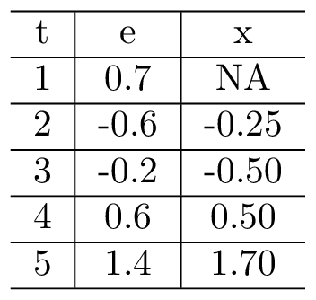

```{r setup, include=FALSE}

#          browseURL('https://raw.githack.com/')
#          browseURL('https://github.com/ajkirkpatrick/EC420MSU')


options(htmltools.dir.version = FALSE)
options("getSymbols.warning4.0"=FALSE)


library(here) # creates absolute paths, but those won't work in html
library(knitr)
library(kableExtra)
library(tidyverse)
library(wooldridge)
require(lubridate)
require(scales)
require(broom)
require(visualize)

require(wbstats)
require(lmtest)
require(sandwich)
require(car)
require(quantmod)
require(patchwork)


# https://yihui.org/knitr/options/
opts_chunk$set(
  fig.align="center",
  #dpi=300, 
  fig.path='figs/', # where figs are rendered
  cache=F,
  echo=F,
  message = F,
  warning = F
  )

oldgraphics = "C:/Users/jkirk/OneDrive - Michigan State University/Teaching/EC420MSU/graphics"
dir.create('img')
  
# A vital function to take an absolute path and copy the image into a local img folder.
# # Solves the issue where the rendered html wasn't pointing to the right things. 
# ## Wrap path into includ_graphics() like so:

    #     include_graphics(copy_to_include(path = "C:/Users/jkirk/OneDrive - Michigan State University/Teaching/EC420online/img/MMfig43a.png"))
copy_to_include<-function(path){
  filename.to.use = basename(path)
  if(!grepl('png$|PNG$|jpg$|JPG$|pdf$|PDF$', filename.to.use)) stop('Not a png or jpg')

  file.copy(from = path, to = paste0('img/',filename.to.use))
  return(paste0('img/',filename.to.use))
}

```

layout: true

<div class="msu-header"></div>  


<div style = "position:fixed; visibility: hidden">
$$\require{color}\definecolor{yellow}{rgb}{1, 0.8, 0.16078431372549}$$
$$\require{color}\definecolor{orange}{rgb}{0.96078431372549, 0.525490196078431, 0.203921568627451}$$
$$\require{color}\definecolor{MSUgreen}{rgb}{0.0784313725490196, 0.52156862745098, 0.231372549019608}$$
</div>

<script type="text/x-mathjax-config">
MathJax.Hub.Config({
  TeX: {
    Macros: {
      yellow: ["{\\color{yellow}{#1}}", 1],
      orange: ["{\\color{orange}{#1}}", 1],
      MSUgreen: ["{\\color{MSUgreen}{#1}}", 1]
    },
    loader: {load: ['[tex]/color']},
    tex: {packages: {'[+]': ['color']}}
  }
});
</script>

<style>
.yellow {color: #FFCC29;}
.orange {color: #F58634;}
.MSUGreen {color: #14853B;}
</style>


```{r flair_color, echo=FALSE}
library(flair)
yellow <- "#FFCC29"
orange <- "#F58634"
MSUGreen <- "#14853B"
```


---

class: inverseMSU
name: Overview

# This Deck  

### __Lectures:__

(1) [Introducing Time Series](#section1)

(2) [Functional Forms and Time Trends](#section4)

(3) [Lag Models: Finite Distributed Lag](#section2)

(4) [Properties of Time Series Estimators](#section3)

(5) [Stationarity](#section5)

(6) [Lag Models: MA and AR](#section6)

(7) [Asymptotic Properties](#section7)

(8) [Random Walk](#section8)


---
class: heading-slide
name: section1

Introducing Time Series

### [top](#Overview)


---
class: MSU
# Introducing Time Series

### We shift gears entirely
- Work with time series
  - Single unit of observation, but many observations
  - Always over time
  - Time flows one way
  
### This video
- Define time series
- Terminology


---
class: MSU
# Introducing Time Series

### Time series data is any data that has a *temporal order*
- Can be ordered by time
- Time only flows one way, which is helpful.

### Time series usually implies a single unit of observation with multiple observations
- E.g. it isn't panel data
- But panel data can be thought of as $N$ time-series'.
- For now, one unit of observation, $T$ observations.

### Stochastic Process
- A **stochastic process** or **time series process** is a *sequence of random variables indexed by time*
- "Stochastic" means "random"

---
class: MSU
# Introducing Time Series

### Each sequence we observe is a *realization* of the stochastic *process*
- Just as we pulled a sample from a population, the time series data we *do* observe can be thought of as a drawn from a population of possible time series' that follow a process.
- The "population" then is the set of all possible time series' that could have been drawn.
- We only get to see one realization of the possible time series.
- We want to learn about the underlying structure that is common to the population
  - How do things change over time?
  
---
class: MSU
# Introducing Time Series

### Let's think about a silly example
How about a "pendulum" sort of process where each observation in time is simply -1 times the previous result, plus a tiny bit of error:

.pull-left[
|  t  |  Value   |
|:---:|:--------:|
|  1  |   2      |
|  2  |   -2.01  |
|  3  |   2.005  |
|  4  |  -2.0072 |
|  5  |  2.012   |
]

.pull-right[
- It doesn't take too many observations in our sample to figure out the *process*, right?
- Though who knows, maybe observation 6 is -23.71.
- But if we could safely assume that the process can't go completely bonkers, then we could infer things about the population process from our sample.
]

---
class: MSU
# Introducing Time Series

### That's what time series econometrics is all about
- Make safe assumptions
- Observe sample drawn from a population process we want to learn about
- Model process and estimate parameters that describe it


---
class: heading-slide
name: section2


Functional Forms and Time Trends


### [top](#Overview)


---
class: MSU
# Time Trends

### We begin with some simple ways of specifying time
- Just to get us thinking about time series
- To see the parallels with our cross-sectional methods

---
class: MSU
# Time Trends

### Many time series have seasonal factors
- Unemployment especially - Nov-Dec reflects temporary holiday employment at FedEx or Amazon or Sears
- Census employment every 10 years for 1 year

$$\begin{eqnarray}
y_t &=& \beta_0 + \beta_1 1(Winter) + \beta_2 1(Spring) + \beta_3 1(Summer)  \\
&+& \beta_4 x_t + \beta_5 x_{t-1} + \beta_6 1(census)+  u_t
\end{eqnarray}$$

---
class: MSU
# Time Trends

### If there is a natural, smooth progression in the $y$, we may want to control for it
It may be due to unobserved factors, but much like a fixed effect, we don't have to see it to control for it. $t$ is continuous here:

$$y_t = \alpha_0 + \alpha_1 x_1 + \alpha_2 x_2 + \alpha_3 t + u_t$$

- $\alpha_3$ is a linear time trend. It says that $y_t$ goes up by $\alpha_3$ per t.
- Ignoring this would make $y_t$ correlated with *anything* that is growing just like $y$
  - A regression of "number of total posts on Instagram" and "number of drownings in the ocean" will probably be correlated because both tend to grow over time.
- This is an example of a **spurious regression problem**

### Including the time trend $t$ in the regression fixes this

---
class: MSU
# Time Trends

### What about the $x$'s when we include a time trend?
$$\color{green}{y_t = \beta_0 + \beta_1 x_{1,t} + \beta_2 t + u_t}$$

Remember, we can think of the *partialling out*:
$$y_t = \alpha_0 + \alpha_1 t + v_t$$
$$\tilde{y}_t = y - \hat{\alpha}_0 - \hat{\alpha}_1 t$$

Same for $x_t$
$$x_t = \delta_0 + \delta_1 t + w_t$$
$$\tilde{x}_{1,t} = x_t - \hat{\delta}_0 - \hat{\delta}_1 t$$
### These are the $y$ and $x$ time series *without* their time trends. They are *detrended*.

---
class: MSU
# Time Trends

### Then, when we regress 
$$\color{green}{y_t = \beta_0 + \beta_1 x_{1,t} + \beta_2 t + u_t}$$

We are doing the equivalent to

$$\tilde{y}_t = \gamma_0 + \gamma_1 \tilde{x}_1 + \epsilon_t$$
And $\gamma_1=\beta_1$. This is the regression of the *detrended* $y$ on the *detrended* $x$.

---
class: MSU
# Time Trends

### If we log-transform $y_t$, we get a trend in percent change which is exponential
```{r TimeTrendExp, echo=F, include=T, out.width='80%'}
knitr::include_graphics(copy_to_include(file.path(oldgraphics, 'Figure 10-3.jpg')))
```


---
class: heading-slide
name: section3


Lag Models: Finite Distributed Lag


### [top](#Overview)


---
class: MSU
# Lag Models

### The **static** model
$$y_t = \beta_0 + \beta_1 z_t + u_t$$

- Looks just like our usual OLS model, but instead of $i$, we have $t$

- We could run this regression for $\beta_1$

---
class: MSU
# Lag Models

### There are many different ways we can account for things that happen over time
- We could let our outcome $y$ in time $t$, say $y_t$, be a function of current values of $z$ *and* past values of $z$.
- We could let $y_t$ be a function of past values of $y$, say $y_{t-1}$
- We could let $y_t$ be a function of past values of $u$ as well.

### We have specific names for the types of time series models we might employ.
- Each one describes a different dynamic process
- Here is one of them: Finite Distributed Lag
- More will come later once we talk about desirable properties of time series


---
class: MSU
# Lag Models: FDL

### Finite Distributed Lag (FDL) Model
$$\color{blue}{y_t = \alpha_0 + \delta_1 z_t + \delta_2 z_{t-1} + \delta_3 z_{t-2} + u_t}$$

The subscripts are not indicating different $z$ variables. The subscripts refer to the ordering in time.

We call the previous time period the "lag", so this is "y regressed on z, the first lag of z, and the second lag of z"

The FDL is saying that:
- $E[y_t|z_t, z_{t-1}, z_{t-2}]$ at time $t$ is explained by contemporaneous $z$, the previous period's $z$ (which is $z_{t-1}$), and the $z$ before that, $z_{t-2}$.
  - "contemporaneous" means "at the same time".
  - Notice that our PRF tells us $E[y_t]$ conditional on a bunch of **lags** (previous values) of $z$. 

---
class: MSU
# Lag Models: FDL

### In the previous slide's Finite Distributed Lag model:
The marginal effect of $z$ (the effect of increasing $z$ by one unit) is now *time-specific*
$$\frac{dy_{s}}{dz_{t}} = \begin{Bmatrix}
\delta_1 &\text{ if s = t}\\
\delta_2 &\text{ if s = t+1}\\
\delta_3 &\text{ if s = t+2}\\
0 &\text{ otherwise}
\end{Bmatrix}$$

<br><br>
### This is a FDL with order two
becuase there are two lags of $z$ in addition to the contemporaneous $z$

---
class: MSU
# Lag Models: FDL

### We are essentially "tracing out" the effect of an increase in $z$ at time $t$
$$\color{blue}{y_t = \alpha_0 + \delta_1 z_t + \delta_2 z_{t-1} + \delta_3 z_{t-2} + u_t}$$

If $z_t$ were one unit higher (permanently):
- $E[y_t]$ would be $\delta_1$ higher
- $E[y_{t+1}]$ would be $\delta_1+\delta_2$ higher
- $E[y_{t+2}]$ would be $\delta_1+\delta_2+\delta_3$ higher
- $E[y_{t+3}],\cdots$ would be $\delta_1+\delta_2+\delta_3$ higher

```{r W101, echo=F, include=T, out.width='30%', fig.cap='Lag distribution'}
knitr::include_graphics(copy_to_include(file.path(oldgraphics, 'Figure 10-1.jpg')))
```


---
class: MSU
# Lag Models: FDL

### We call the contemporaneous effect, $\delta_1$, the "impact multiplier"

### If we add up all of the $z$ coefficients, $\delta_1+\delta_2+\delta_3$
then we get the total cumulative changes in $y$. This is the **long run multiplier**.

<br>
### Why care about the **long run multiplier**?
If $y$ were "monthly wages" and $t$ were month, then the **long run multiplier** would be the total monthly wage increase due to the one-unit, permanent change in $z$. 
- It adds up all of the lagged effects.


---
class: MSU
# Lag Models: FDL

### A FDL of order $q$
$$y_t = \alpha_0 + \delta_0 z_t + \delta_1 z_{t-1} + \cdots + \delta_q z_{t-q} +  u_t$$

### With Long Run Multiplier (or Long Run Propensity):
$$LRP=\delta_0 + \delta_1 + \cdots + \delta_q$$

### This is a **static model** if we set:
$$\delta_2, \delta_3, \cdots, \delta_q=0$$

---
class: MSU
# Lag Models: FDL

### In any time series (and in the FDL)
things tend to be correlated over time. $z_t$ and $z_{t-1}$ are probably not independent

$z_t$ and $z_{t-1}$ might even be highly correlated
- so in a regression with $z_t$ and $z_{t-1}$, we could have multicolinearity problems
- which leads to imprecise estimates (high $se(\hat{\delta_2})$)


<br><br>
### Let's look a the properties of the time-series estimators


---
class: heading-slide
name: section4

Properties of Time Series Estimators


### [top](#Overview)


---
class: MSU
# Properties of Time Series Estimators

### Are time series estimators 
- Unbiased? 
- Consistent?
- What is the distribution of $\hat{\beta}$?

### Let's look at the time series analog to MLR.1-MLR.6
- These will be assumptions we can make about the data that will let us show that time series estimators are unbiased

--

First, a little notation:

---
class: MSU
# Properties of Time Series Estimators

```{r SampleTS1, echo=F, include=T, warning=F, out.width='60%'}
ts1 = tibble(
  t = 1:4,
  x_1 = c(2,3,1,2),
  x_2 = c(.2, .24, .33, .31),
  x_3 = c(100, 100, 104, 101)
)

# C:\PROGRA~1\MIKTEX~1.9\miktex\bin\x64\xelatex.exe -interaction=batchmode C:\Users\jkirk\AppData\Local\Temp\Rtmp4MkRFc\file28ac2c2b17d6.tex

#temp_tex_file = 'C:\\Users\\jkirk\\AppData\\Local\\Temp\\Rtmp4MkRFc\\file28ac2c2b17d6.tex'

# tt = knitr::kable(ts1, align='c', escape = F, col.names = c("$t$"," $x_1$ "," $x_2$ "," $x_3$ "), format='latex')
# aa = jsave_kable_latex(tt, 'something2.png', keep_tex=T)  
include_graphics(copy_to_include(file.path(oldgraphics, 'something2.png')))
# knitr::include_graphics('something2.png')
# ?normalizePath

```

$x_{2,2}=.24$

$\mathbf{x}_{t_1} = \{2,.20,100\}$

$\mathbf{X}$ = the whole thing.

---
class: MSU
# Properties of Time Series Estimators

### TS1 - Linear In Parameters: 
$$y_t = \beta_0 + \beta_1 x_{t1} + \cdots + \beta_k x_{tk} + u_t$$

### TS2 - No Perfect Collinearity: 
No independent variable (RHS) is constant nor a perfect linear combination of the others.

---
class: MSU
# Properties of Time Series Estimators

### TS3 - Zero Conditional Mean 
$$E[u_t|\mathbf{X}] = 0, \quad t= 1, 2, \cdots, n$$
- Note the $\mathbf{X}$. This is saying that $u_t$ is uncorrelated with **every** $x$ in all time periods. 
- Even in the future!
- Call this *strict exogeneity* or *nonrandom X*

---
class: MSU
# Properties of Time Series Estimators

### TS3 - Zero Conditional Mean

#### Strict exogeneity can fail due to:
- Omitted variables
- Measurement error (we will cover this later)
- $u_t$ correlated with $x_{t-s}$ where $s$ is any lag/lead.
  - Let's say $x_{t-1}$ has an effect on $y_{t}$ and we don't specify a FDL
$$\begin{eqnarray}
y_{t} &=& \beta_0 + \beta_1 x_t + \tilde{u_t} \nonumber \\
y_{t} &=& \beta_0 + \beta_1 x_t + \{\gamma_1 x_{t-s} + u_t\} \nonumber
\end{eqnarray}$$

Here, $\gamma_1$ is the correlation between $x_{t-s}$ and $y_t$ which is not in the model.

The error term we end up with, $\tilde{u}_t$ has $x_{t-s}$ in it, and thus $E[\tilde{u}_t|\mathbf{X}] \neq 0$

.font70[(We could include a lag of $x$ with a FDL(s) model and solve this particular problem)]

---
class: MSU
# Properties of Time Series Estimators

### TS3 - Zero Conditional Mean

#### Strict exogeneity can also fail due to:
- $y_t$ or $u_t$ has an effect on $x_{t+1}$: $x_{t+1} = \gamma_1 u_t + v_t$
- If $\tilde{x}_{t+1}$ is correlated with $y_{t}$, and since $y_{t}$ is very much correlated with $u_{t}$, then $x_{t+1}$ is correlated with $u_{t}$ and $E[u_t|\mathbf{X}] \neq 0$. We have violated *strict exogeneity*.

---
class: MSU
# Properties of Time Series Estimators

### TS3 - Zero Conditional Mean
- If we have the "right" number of lags in a FDL, we are controlling for the effect of past $x$
  - That means we don't have to worry if $x_t$ is correlated with $u_{t-1}$ in a one-lag FDL.
  - Because it is *controlled for* - just like when we included the omitted variable that caused bias.
- **But** we do worry about $y_t$ having an effect on $x_{t+1}$ still. 
  - A FDL doesn't fix that.
  - THis is common in social sciences like economics
  
  
---
class: MSU
# Properties of Time Series Estimators

### TS1 - Linear In Parameters: 
$$y_t = \beta_0 + \beta_1 x_{t1} + \cdots + \beta_k x_{tk} + u_t$$

### TS2 - No Perfect Collinearity: 
No independent variable (RHS) is constant nor a perfect linear combination of the others.

### TS3 - Zero Conditional Mean:
$$E[u_t|\mathbf{X}]=0$$
<br>

## Under assumptions TS1, TS2, and TS3 hold, our OLS estimator is **unbiased.**

---
class: MSU
# Properties of Time Series Estimators

We need two more assumptions to get a variance of our estimator:

### TS4 - Homoskedasticity:
$$Var[u_t | \mathbf{X}] = Var[u_t] = \sigma^2, \quad t=1,2,\cdots,n$$

### TS5 - No Serial Correlation
$$Corr(u_t, u_s | \mathbf{X}) = 0\quad \forall t\neq s$$
- Conditional on $\mathbf{X}$, errors at any two times $t$ and $s$ are uncorrelated.
- This is a **huge** assumption
- Let's discuss this...


---
class: MSU
# Properties of Time Series Estimators

### TS5 - No Serial Correlation
- Serial Correlation is lso known as *autocorrelation*
- Imagine you have a time series of $y_t = \beta_0 + \beta_1 x_t + u_t$
- Now, imagine that some unobserved influence increased $y_{t+1}$ by a small amount
  - $u'_{t+1}>u_{t+1}$
  - The new $u$ is a little larger than what would have been without the unobserved influence
--
- Thus far, this is not a problem
- But...if that effect is persistent and $u'_{t+2}>u_{t+2}$
  - Now, what you observe is $u'_{t+1},u'_{t+2}$ and those two *are correlated*.


---
class: MSU
# Properties of Time Series Estimators

### Serial Correlation
- Another way of thinking of Serial Correlation is this:
  - If knowing that $u_{t}>0$ told you something about $u_{t+1}$, then $Corr(u_t, u_{t+1})\neq 0$.
  - This violates assumption TS5
  
### This was not a problem when we had *random sampling* in MLR.
- There was no "order" to $i$.
- But here, we are randomly drawing the series from the population of possible series.

### TS5 does *not* require anything of $Corr(x_t,x_{t+1})$
- This is about the *unobserved*, not the observed $\mathbf{X}$
---
class: MSU
# Variances

### Under assumptions TS1-TS5
$$Var(\hat{\beta}_j|\mathbf{X}) = \frac{\sigma^2}{SST_j(1-R_j^2)}, \quad j=1,\cdots,k$$
- This is our usual expression for the variance of the $\beta_j$ in MLR.
- We estimate $\hat{\sigma}^2$ the same way: $\hat{\sigma}^2 = \frac{1}{N-k-1} \sum \hat{u}_t^2$
- (BLUE): the OLS estimator is the Best Linear Unbiased Estimator conditional on $\mathbf{X}$ 
--


### TS6 - Normality and *iid* errors, we have the same inference as before
- $t$-statistic, $F$-statistic, confidence intervals, and p-values.

---
class: MSU
# Properties of Time Series Estimators

### TSR1 - TSR6 are very restrictive
- Remember, we had to assume no serial correlation, nonrandom $\mathbf{X}$ with no effect of $y_t$ on $x_{t+1}$.

### If we make these heroic assumptions
- We can use dummy and factor variables just the same
- Natural logs, $ln(x_t)$, are percentage changes just the same
- We can do an *event study analysis*
  - A time-series with a binary dummy for treatment

### We will relax these assumptions in a little bit


---
class: heading-slide
name: section5


Stationarity


### [top](#Overview)


---
class: MSU
# Stationary TS

### Chapter 11 introduces *stationary* time series:
- A stationary time series is a time series where the *joint distribution* of the variables in the time series is the same in each time period.

- If the *joint pdf* of $(x_{t},x_{t+1})$ is the same as the joint distribution of $(x_{t+h},x_{t+1+h})$, then $x_t$ is *stationary*.

- The series can be *stationary* but also highly correlated. In fact, $x_{t}=x_{t+1}$ would mean they are perfectly correlated, but they can still be stationary!

<br>
### If we think of the random sampling in a time series as drawing a chain of observations from the overall population
then we start to see why stationarity is important. It means it doesn't matter where in the "chain" we draw from.

---
class: MSU
# Stationary TS

### Non-stationarity
- Non-stationarity is not uncommon. Think about our time trend regression:
$$\color{green}{y_t = \beta_0 + \beta_1 x_{1,t} + \beta_2 t + u_t}$$
Ignore the $x_{1,t}$ for a moment. It's pretty clear that the joint distribution of $(y_t, y_{t+1})$ is not the same as $(y_{t+h}, y_{t+1+h})$, but we *can* control for that. Sometimes we can't, and that becomes a problem


---
class: MSU
# Stationary TS

### A stationary time series $\{x_t: t=1,2,\cdots\}$ is one where the *joint* distribution of $(x_t, x_{t+h})$ is the same as the joint distribution of $(x_{t+k}, x_{t+h+k}) \forall k,h \geq 1$

Remember the idea of a time series being a realization of a sequence? "Pulling a chain" out of a bag of all possible chains?

### Joint Distribution includes
- The mean of $x_t$
- The mean of $x_{t+h}$
- The variance of $x_t$
- The variance of $x_{t+h}$
- The covariance of $(x_{t},x_{t+h})$

**Stationary** implies *identically distributed*. Imagine $h=1$. Then $x_t$ and $x_{t+1}$ have the same mean and variance when stationary.


---
class: MSU
# Stationary TS

### But **stationary** means even more.

### **Stationarity** says that the relationship over time is stable. 
That whatever stochastic process drives the relationship between $x_t$ and $x_{t+h}$ also applies, in a random sense, to $x_{t+k}$ and $x_{t+h+k}$.

```{r TimeLine, echo=F, include=T, out.width='95%'}

par(xaxs='i', yaxs = 'i', mar=c(1,0,0,0))
plot(NA, xlim=c(-1,11), ylim=c(-1,.1), axes=F, ann=F)
segments(0, 0, 10, 0, lwd=3, col='blue')
points(1:9, rep(0, length(1:9)), pch=16, cex=3.5, col='blue')
text(0:9, rep(0, length(1:9)+1), labels=c('x:', as.character(1:9)), adj=c(.5, 3), cex=2 )
```


---
class: MSU
# Stationary TS

### Why is non-stationarity a problem?
> (I)f we want to understand the relationship between two or more variables using regression analysis, we need to asssume some sort of stability over time. If we allow the relationship between two variables to change arbitrarily in each time period, then we cannot hope to learn much about how a change in one affects the other(...)

<br>

### Much of time series econometrics is about being very specific as to how big of a problem this may be, and when it stops being a problem
- If we assume that everything past one lag is uncorrelated, time series is very easy!
- We already saw that assuming $y_t$ has no effect on $x_{t+1}$ made things very easy!


---
class: MSU
# Covariance stationarity

### A weaker form of stationarity is **covariance stationarity**
This holds when:
1. $E[x_t]$ is constant
2. $Var(x_t)$ is constant
3. For any $t,h$, $Cov(x_t, x_{t+h})$ depends only on $h$, not on $t$.

The first two are straightforward. The third simply means that the correlation structure is the same.
- $x_1$ and $x_3$ may be correlated...
- ...but $x_2$ and $x_4$ have the same correlation
- Correlation is a *population* concept.

### This is sometimes called *weak stationarity*

### TS5, "no correlation in $u_t, u_{t+h}$", meets this

---
class: MSU
# Covariance stationarity

### Let's pause for a moment

These conditions are all ways of saying that 

> "regardless of *where* in the chain our sample is drawn, we can learn about *how* the chain behaves from our observation".


---
class: MSU
# Weak dependence

### Stationarity is about how stable the relationship is between $(x_{t},x_{t+h})$
For a variety of $t$ and $h$

### We need a concept that tells us how large $h$ has to be to say that $x_t$ and $x_{t+h}$ are essentially unrelated

--

### Weak dependence
A **weakly dependent** time series $\{x_t:1,2,\cdots\}$ is one where, as $h$ gets larger, $x_t$ and $x_{t+h}$ become "almost independent".
- If it is *covariance stationary* and
- $Cov(x_t, x_{t+h}) \rightarrow 0$ as $h\rightarrow \infty$
- "Asymptotically uncorrelated"


---
class: MSU
# Weak dependence

### If a time series is weakly dependent, then we have a Central Limit Theorem (CLT) and Law of Large Numbers (LLN) that can apply
The CLT is what let us say that we could ignore non-normal errors
The LLN is what let us say that averages, with large enough $N$, are unbiased estimates of the population average.
- This let us say that $E[\hat{\beta}]=\beta$


---
class: heading-slide
name: section6

Lag Models: Autoregressive and Moving Average


### [top](#Overivew)


---
class: MSU
# Lag Models: AR and MA

### It will turn out (next section) that weak dependence and covariance stationarity lets us relax some of our TSR assumptions
- So far, we have had to make pretty big assumptions to say our time series estimators are unbiased
- We can relax a little bit

### So let's look at two more lag models
- and let's see if they have our desired properties

---
class: MSU
# Lag Models: AR and MA


### One useful weakly dependent model: **Moving Average**
$$\color{darkorange}{x_t = e_t + \alpha_1 e_{t-1}}$$
- $e_t$ is a random i.i.d. sequence with zero mean and constant variance
- The  process $\{x_t\}$ is a **Moving Average of order one (MA(1))**

---
class: MSU
# Lag Models: AR and MA

$$\color{darkorange}{x_t = e_t + \alpha_1 e_{t-1}}$$

```{r MA1, echo=F, include=T, out.width = '35%'}
NN = 5
ma1 = tibble(t = 1:NN,
             e = round(rnorm(NN, 0, 1), 1),
             x = e + .5*dplyr::lag(e, n=1)) 

knitr::kable(ma1, align='c', pos = 'c', format = 'latex') %>%
  as_image(file = 'img/MA1.png', width = 5)


```
### $x$ has constant mean, constant variance

### $x_t$ and $x_{t+h}$ have the same covariance $\forall$ $h$

### $Cov(x_t, x_{t+h})=0 \quad \forall h\geq 2$

---
class: MSU
# Lag Models: AR and MA

### We can go beyond the first lag of $e$ and have a MA(2) or more...
$$x_t = e_t + \alpha_1 e_{t-1} + \alpha_2 e_{t-2}$$

- This is still stationary (try taking expectation of each side)
  - $E[x_t] = E[e_t] + \alpha_1 E[e_{t-1}] + \alpha_2 E[e_{t-2}]$
  - $\rightarrow E[x_t] = 0 + 0 + 0$ which does not depend on $t$
  
- This is still weakly dependent
  - Is there an $h$ where $Cov(x_t, x_{t+h})=0$?
  - Yes! $h>2$ does it.

---
class: MSU
# Lag Models: AR and MA

### Another useful model: **Autoregressive**
$$\color{red}{y_t = \rho_1 y_{t-1} + e_t}$$
- $\{e_t:t=1, 2, \cdots\}$ is i.i.d. with zero mean and constant variance $\sigma^2_e$
- So $e_t$ is independent of $y$
- Each $y_t$ is equal to some fraction of the previous $y_t$ **and** that new error term, $e_t$.
  - Sometimes called an "innovation"
- There is some $y_0$ that started it all


### Imagine for a moment that $\rho_1>>1$
- How does $y_t$ behave over time?


---
class: MSU
# Lag Models: AR and MA

### The **AR(1)** process:
$$\Large \color{red}{y_t = \rho_1 y_{t-1} + e_t}$$
### We can show that, if $\rho_1<1$, then $y_t$, our **AR(1)** process, is weakly dependent.
- $\rho_1 < 1$ is called a "stable AR(1)"
--

This is largely because $e_t \perp y_{t-1}$ (independent)

$Var(y_t) = Var(\rho_1 y_{t-1}) + Var(e_t) = \rho_1^2 Var(y_{t-1}) + Var(e_{t})$


$\Rightarrow \sigma^2_y = \rho^2 \sigma^2_y + \sigma^2_e$
  
As long as $\rho<1 \rightarrow \rho^2<1$, then we can get:
$$\sigma^2_y = \frac{\sigma^2_e}{1-\rho_1^2}$$
---
class: MSU
# Lag Models: AR and MA

### Wooldridge 11-1 shows that $Corr(y_t, y_{t+10})>Corr(y_t, y_{t+20})$ when $\rho<1$
Thus, AR(1) is weakly dependent.


---
class: MSU
# Lag Models: AR and MA

### The AR(1) model violates **strict exogeneity**
$E[u|\mathbf{X}]\neq 0$

1. First, note that $E[u|x]=0$ is the same as $E[u_t x_t]=0$ when $E[u_t]=0$.
  - Now, our lag of $Y$ is contained in $\mathbf{X}$
2. So strict exogeneity says $E[u_t y_{t-1}]=0$
  - Let us assume this holds
3. It must also be true that $E[u_t y_{t+1}]=0$. Does it?
  - $\rightarrow E[u_t (\beta_1 y_t + u_t)] = 0$
  - $\rightarrow E[u_t (\beta_1 (\beta_1 y_{t-1} + u_{t-1}) + u_t)] = 0$
  - $\rightarrow E[u_t \beta_1^2 y_{t-1} + \beta_1 u_t u_{t-1} + u_t^2]= 0$
  - $\rightarrow \beta_1^2 \underbrace{E[u_t y_{t-1}]}_{0} + \underbrace{\beta_1 E[u_t u_{t-1}]}_{0} + \underbrace{E[u_t^2]}_{Var(u)\neq0}$
  
The only way strict exogeneity can hold in an AR(1) model with $y_{t-1}$ on the right side is if $u_t$ has no variance.


--

### But how does weakly dependent help?


---
class: heading-slide
name: section7


Asymptotic Properties of TS OLS


### [top](#Overview)

---
class: MSU
# Asymptotic Properties

### TS.1' - Linearity and Weak Dependence
$$\{(\mathbf{x}_t, y_t):t = 1, 2, \cdots\}\text{ is stationary and weakly dependent}$$

in a model such as:

$$y_t = \beta_0 + \beta_1 x_{1,t} + \beta_2 x_{1,t-1} + \cdots + \beta_j y_{t-1} + u_{t}$$
Note that
- $\mathbf{x}$ has $x$ and lags of $x$
- $\mathbf{x}$ also has lags of $y$

### Really, we just need weak dependence, but Wooldridge includes stationarity

--

### TS.2' - No Perfect Multicolinearity (same as before)

---
class: MSU
# Asymptotic Properties

### TS.3' - $\mathbf{x}_t$ is contemporaneously exogenous
$$E[u_t | \mathbf{x}_t] = 0$$

We've relaxed that pernicious **strict exogeneity** assumption from before by adding TS.1'

- Remember, **strict exogeneity** was $E[u_t | \mathbf{X}]=0$, all future values of $\mathbf{x}_t$.

- So as long as TS.1' and TS.3' hold, we don't have to worry about correlation between $u_{t-1}$ and $x_t$, even when it's because $x_t$ is related to past $y_{t-1}$!


---
class: MSU
# Asymptotic Properties

### With TS.1', TS.2', TS.3', $\hat{\beta}$ is consistent
Not necessarily unbiased, but with larger and larger $N$, the estimate gets better!

So our **AR(q)** model estimators, if it meets TS.1'-TS.3', are consistent.
- To meet TS.1', it has to be stable

So are our **MA(q)** model estimators.

So are our FDL estimators, even when future values of $x_t$ are affected by $y_{t-1}$

---
class: MSU
# Asymptotic Properties

### TS.4' - Contemporaneous homoskedasticity
$$Var(u_t|\mathbf{x}_t) = \sigma^2$$

As opposed to TS.4 - $Var(u_t | \mathbf{X}) = \sigma^2$
<br>
### TS.5' - No Serial Correlation
$$Corr(u_t, u_s | \mathbf{x}_t, \mathbf{x}_s) = 0 \quad \forall t,s$$
As Wooldridge says, ignore the conditioning and just think of whether or not $u_t$ and $u_s$ are correlated.

--

Note that specifying an **AR(1)** when the real process is **AR(2)** results in serial correlation (because $y_{t-2}$ is in the error and $y_t$ is serially correlated)

---
class: MSU
# Asymptotic Properties

### Under TS.1'-TS.5', the errors are asymptotically normally distributed
Which lets us use $t$-statistics, $F$-tests, confidence intervals, p-value, etc.

We've skipped assuming normal errors and gone straight to using the **asymptotic properties**.

So we need to be able to say we have a large $N$
- Which means a large $T$

---
class: MSU
# Asymptotic Properties

Serial correlation in $u$ is not the end of the world. We won't get to the solution, but briefly, here's how it works:

### Heteroskedasticity and Autorcorrelation-Consistent Errors
or **HAC**, are calculated for each $\beta_j$ by multiplying each "naive" OLS std. error by a correction factor, $\hat{v}_j$
- $\hat{v}_j$ is a function of two things:
  - $u_t$, as one would expect
  - $r_t$, where $r_t$ is the error in $x_{jt} = \alpha_0 + \alpha_1 x_{kt} + \cdots + r_t$
  - When $\hat{u}_t$ covaries with $\hat{r}_t$ (the part of $x_{jt}$ not explained by $\mathbf{x}_t$), the correction factor $\hat{v}_j$ gets bigger.
  - When lags of $\hat{u}_t \times \hat{r}_t$ covary, $\hat{v}_j$ gets bigger.
  - How many lags to include is a question for another day (1? 2? 10?)
  


---
class: heading-slide
name: section8


Random Walk


### [top](#Overview)


---
class: MSU
# Random Walk

### A **random walk** is a highly persistent time series
It is not *weakly dependent*, so it poses a problem to TS.1'-TS.5'

### A random walk is a process that follows:
$$y_t = \rho y_{t-1} + e_t \text{ where } \rho=1$$
and $e$ is iid, $E[e] = 0$ (mean zero errors) and $Var(e) = \sigma^2_e$
```{r RW1, echo=F, include=T, out.width='50%'}
NN = 50
y0 = 0
rw = tibble(x = 1:NN,
            eA = rnorm(NN, 0, 1),
            eB = rnorm(NN, 0, 1),
            yA = y0 + cumsum(eA),
            yB = y0 + cumsum(eB))

ggplot(rw, aes(x = x )) + 
  geom_path(aes(y = yA), col='blue') +
  geom_path(aes(y = yB), col='green') + labs(x = 'step', y = 'value')
```


---
class: MSU
# Random Walk

### We can write
$$y_t = \color{purple}{y_{t-1}} + e_t$$
which is the same as 
$$y_t = \color{purple}{y_{t-2} + e_{t-1}} + e_{t}$$
which generalizes to:
$$y_t = y_0 + e_{1} + e_{2} + \cdots + e_{t}$$

---
class: MSU
# Random Walk

### A Random Walk has a constant $E[y_t]$
$$y_t = y_0 + e_{1} + e_{2} + \cdots + e_{t}$$
means
$$E[y_t] = E[y_0] + 0 + 0 + \cdots + 0$$

### But a Random Walk does not have constant variance:
$$Var(y_t) = Var(y_0) + Var(e_1) + Var(e_2) + \cdots + Var(e_t)$$
Which is $t\sigma^2_e$, so it changes over time!

--

### A Random Walk is not stationary and TSR.1'-TSR.5' do not hold!

### Nor is a Random Walk covariance-stationary (depends on $t$), and is not weakly dependent.

---
class: MSU
# Random Walk

### So what do we do? First difference
- Note that the $e_t$ term is iid.
- The issue is that the time series is highly persistent. 
- $\rho=1$ means nothing ever "dies out" as $t\rightarrow \infty$

### First differencing eliminates the persistence:
$$y_t - y_{t-1} = \Delta y_t = (y_{t-1} + e_{t}) - y_{t-1} = e_t$$

And $e_t$ is no longer persistent, no longer fails weak dependence, etc.

--

### Time Series that are weakly dependent after first differencing (FD)
- Are called I(1)
  - Integrated of order one
- I(0) means not integrated (not random walk, no FD necessary)

---
class: MSU
# Random Walk

### So how do we know when $\rho=1$ vs $\rho<1$
- Important because the first requires first differencing
- The second, $\rho<1$, is not highly persistent and is likely to be weakly dependent

### The rough method
- Regress the time series $y_t$ on the first lag $y_{t-1}$ with or without drift and see if $\rho\neq 1$
  - $y_t = \alpha + \rho y_{t-1} + e_t$ where $\alpha$ is the drift term
- Problem is, you only get a consistent estimate of $\rho$ *if* $\rho<1$


### But there's a better way
- We just have to handle the strange properties of an estimator that tests for $\rho=1$ but has to assume that $\rho<1$


---
class: MSU
# Random Walk


### Dickey-Fuller
- See Ch. 18, *Testing for Unit Roots*
- Define $\theta = \rho-1$
- Subtract $y_{t-1}$ from both sides of $y_t = \alpha + \rho y_{t-1} + e_t$
- $\rightarrow \Delta y_t = \alpha + \theta y_{t-1} + e_t$
- Test if $\theta = 0$
- Dickey and Fuller (1979) showed that the distribution of this t-statistic has to be adjusted for the situation where $\rho=1$
  - Adjustment can be expressed as new critical values with $\pm 2.86$ replacing our usual $\pm 1.96$
- Rejecting null hypothesis is equivalent to rejecting that $\rho=1$
  - So rejecting null is rejecting Random Walk, rejecting that $y$ is I(1)
  
### Fail to reject Dickey-Fuller?
- If we fail to reject, then we say the data does not provide evidence against the series being I(1)
- So we first difference it.

---
class: MSU
# Thats It

### You've made it to the end of time series

--

### And to the end of the course

Congratulations.


